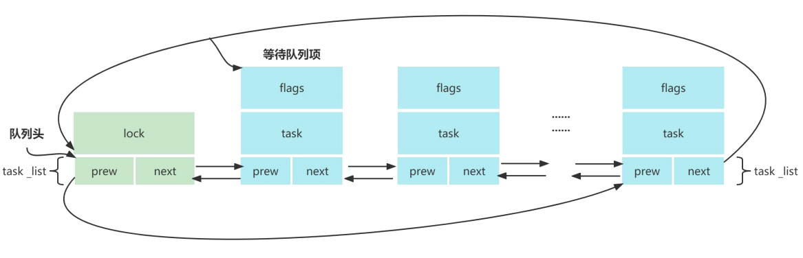

# 基础概念

## 应用层和驱动层对应关系

| 应用层 | 驱动层的 file_operation 结构体成员 |
| ------ | ---------------------------------- |
| read   | read                               |
| write  | write                              |
| ioctl  | unlocked                           |
| open   | open                               |
| close  | release                            |

## 内核空间与用户空间的数据交换

1. 内核空间中的代码控制了硬件资源，**用户空间中的代码只能通过内核暴露的系统调用接口来使用系统中的硬件资源**，这样的设计可以保证操作系统自身的安全性和稳定性。
2. 在 32 位 Linux 系统中，整个虚拟地址空间为 4GB，通常划分：
   - **用户空间**: 从地址 0x00000000 到 0xBFFFFFFF（共3GB），用于运行用户进程和应用程序。
   - **内核空间**: 从地址 0xC0000000 到 0xFFFFFFFF（共1GB），用于操作系统内核和驱动程序。
3. **进程只有从用户空间切换到内核空间才可以使用系统的硬件资源**，切换的方式有三种：**系统调用**，**软中断**，**硬中断**。
4. **内核空间和用户空间的内存是不能互相访问的**，因此我们需要利用 `copy_to_user()` 函数把内核空间的数据复制到用户空间，利用 `copy_from_user()` 函数把用户空间的数据复制到内核空间。

```c
/* 作用 : 将数据从内核空间复制到用户空间
 * to   : 目标地址，指向用户空间的缓冲区
 * from : 源地址，指向内核空间的缓冲区
 * n    : 要复制的字节数
 * 返回值 : 该函数返回未能复制的字节数。如果成功复制所有数据，则返回值为0。如果发生错误（例如，目标地址不可访问），则返回相应的字节数
 */
unsigned long copy_to_user(void __user *to, const void *from, unsigned long n);

/* 作用 : 从用户空间复制到内核空间
 * to   : 目标地址，指向内核空间的缓冲区
 * from : 源地址，指向用户空间的缓冲区
 * n    : 要复制的字节数
 * 返回值 : 该函数同样返回未能复制的字节数。如果成功复制所有数据，则返回值为0。如果发生错误（例如，源地址不可访问），则返回相应的字节数
 */
unsigned long copy_from_user(void *to, const void __user *from, unsigned long n);
```

5. **注：当应用层调用 `read()` 函数时，我们也可以给驱动层传递数据，但不建议这么做！**

```c
/******* 应用层 *******/
// buf[0] 为传递给驱动层的数据，buf[1] 为驱动层返回的数据
char buf[2];
buf[0] = strtol(argv[1], NULL, 0);
ret = read(fd, buf, 2);

/******* 驱动层 *******/
// 查看应用层希望获得那个 GPIO 的电平信息
ret = copy_from_user(tmp_buf, buf, 1);
// 读取电平
tmp_buf[1] = gpio_get_value(gpios[(int)tmp_buf[0]].gpio);
// 将读取到的数据返回给应用层
ret = copy_to_user(buf, tmp_buf, 2);
```

# IO 模型

1. IO 模型根据实现的功能可以划分为为**阻塞 IO**、**非阻塞 IO**、**信号驱动 IO**， **IO 多路复用**和**异步 IO**。根据等待 IO 的执行结果进行划分，**前四个 IO 模型又被称为同步 IO**。
2. 所谓同步，即发出一个功能调用后，只有得到结果该调用才会返回。
   - **非阻塞 IO** : 非阻塞 IO 进行 IO 操作时，如果内核数据没有准备好，内核会立即向进程返回 err，不会进行阻塞。非阻塞 IO 的优点是**效率高**，同样的时间可以做更多的事。但是缺点也很明显，**需要不断对结果进行轮询查看**，从而导致结果获取不及时。
   - **IO 多路复用** : 通常情况下使用 `select()、poll()、epoll()` 函数实现 IO 多路复用。
   - **信号驱动 IO** : 系统在一些事件发生之后，会**对进程发出特定的信号**，而信号与处理函数相绑定，**当信号产生时就会调用绑定的处理函数**。例如在 Linux 系统任务执行的过程中可以按下 `Ctrl+C` 来对任务进行终止，系统实际上是对该进程发送一个 `SIGINT` 信号，该信号的默认处理函数就是退出当前程序。
   - **异步 IO** : aio_read 函数常常用于异步 IO，当进程使用 aio_read 读取数据时，如果数据尚未准备就绪就立即返回，不会阻塞.
3. 当一个异步过程调用发出后，调用者并不能立刻得到结果，实际处理这个调用的部件在完成后，通过状态、通知和回调来通知调用者。

## 阻塞IO

### 基础概念

1. 进程在操作 IO 时，首先先会发起一个系统调用，从而转到内核空间进行处理，内核空间的数据没有准备就绪时，进程会被阻塞，不会继续向下执行，直到内核空间的数据准备完成后，数据才会从内核空间拷贝到用户空间，最后返回用户进程。**比较有代表性的是 C 语言中的 `scanf()` 函数。**

2. **阻塞 IO 在 Linux 内核中是非常常用的 IO 模型，所依赖的机制是等待队列**。

3. 等待队列分为**等待队列头**和**等待队列项**。**等待队列项可以是空的，只是用一个单独的头部也可以表示一个等待队列**。



### API 介绍

#### 创建等待队列头

1. 当我们希望静态初始化等待队列头时，可以调用如下 `API`。

| 类型   | 描述                                                      |
| ------ | --------------------------------------------------------- |
| 作用   | 静态初始化等待队列头                                      |
| `name` | 等待队列头名字，最终会产生一个 `wait_queue_head_t` 的变量 |
| 返回值 | 无                                                        |

```c
DECLARE_WAIT_QUEUE_HEAD(name);

/******* 示例 *******/
DECLARE_WAIT_QUEUE_HEAD(my_waitqueue);
```

2. 如果你**事先已经拥有**或者是**通过 `kmalloc`** 获取了一个  `wait_queue_head_t` 的变量，那么我们可以利用如下 `API` 动态的初始化等待队列。

| 类型   | 描述                                          |
| ------ | --------------------------------------------- |
| 作用   | 动态初始化一个 `wait_queue_head_t` 类型的变量 |
| `q`    | 需要被初始化的等待队列头                      |
| 返回值 | 无                                            |

```c
void init_waitqueue_head(wait_queue_head_t *q);

/******* 示例 *******/
wait_queue_head_t my_waitqueue; // 这个也可以通过 kmalloc 获得
init_waitqueue_head(&my_waitqueue);
```

#### 创建等待队列项

1. 一般我们都使用如下宏来给一个正在运行的进程创建并初始化一个等待队列项。

| 类型   | 描述                         |
| ------ | ---------------------------- |
| 作用   | 创建并初始化一个等待队列项   |
| `name` | 定义一个等待队列项的名字     |
| `task` | 当前等待队列项属于哪一个进程 |
| 返回值 | 无                           |

```c
DECLARE_WAITQUEUE(name, task); 
```

#### 等待队列头 添加/删除 等待队列项

1. 当**设备没有准备就绪**（如没有可读数据）而**需要进程阻塞**的时候，就需要**将进程对应的等待队列项添加到前面创建的等待队列中**，只有添加到等待队列中**以后进程才能进入休眠态**。

| 类型   | 描述                               |
| ------ | ---------------------------------- |
| 作用   | 将一个等待队列项加入到等待队列头中 |
| `q`    | 指向**等待队列头**的指针           |
| `wait` | 指向一个**等待队列项**             |
| 返回值 | 无                                 |

```c
void add_wait_queue(wait_queue_head_t *q, wait_queue_t *wait);
```

2. 当设备可以访问时（如有可读数据），再将进程对应的**等待队列项**从**等待队列头**中**移除**即可。

| 类型   | 描述                                           |
| ------ | ---------------------------------------------- |
| 作用   | 将一个等待队列项加入到等待队列头中             |
| `q`    | 指向需要移除**等待队列项**的**等待队列头**指针 |
| `wait` | 指向一个需要被移除的**等待队列项**             |
| 返回值 | 无                                             |

```c
void remove_wait_queue(wait_queue_head_t *q, wait_queue_t *wait);
```

#### 等待事件

1. 如果我们希望当前的进程处于**不可被中断**的睡眠状态（不会响应**操作系统系统**或**其他进程**发送的**信号**，例如 `Ctrl + C`），来等待某个事件完成，那么就可以使用如下函数进入休眠。
   - 但请注意，**硬件中断（如外设产生的中断）依旧会被处理**，因为硬件中断处理是**由内核中断处理程序直接接管**，**不受到进程睡眠状态影响**。
   - 如果发生了**硬件中断处理，并不会唤醒处于睡眠状态（`TASK_UNINTERRUPTIBLE`）的进程**，**除非**中断处理程序显式的**执行了唤醒操作**，例如调用 `wake_up()` 函数。 
   - 因此我们可以得出结论，`wait_event()` 函数所**设置的不可中断状态是针对软件信号，而非处于内核层的硬件中断**。

| 类型        | 描述                                                     |
| ----------- | -------------------------------------------------------- |
| 作用        | 让当前进程处于**不可中断**的睡眠状态，来等待某个事件完成 |
| `q`         | 等待队列头                                               |
| `condition` | 等待条件，当条件为真时，不会休眠；否则进入休眠           |
| 返回值      | 无                                                       |

```c
wait_event(q, condition);
```

2. 当我们**允许当前进程能够被信号中断**（例如可以被 `Ctrl+C` ，强行终止程序）的等待某个事件，那么可以调用如下函数。

| 类型        | 描述                                                   |
| ----------- | ------------------------------------------------------ |
| 作用        | 让当前进程处于**可中断**的睡眠状态，来等待某个事件完成 |
| `q`         | 等待队列头                                             |
| `condition` | 等待条件，当条件为真时，不会休眠；否则进入休眠         |
| 返回值      | 无                                                     |

```c
wait_event_interruptible(q, condition);
```

3. 当我们希望**一次只有一个进程**可以进入到等待队列中，并且处于**可中断**的睡眠状态，那么可使用如下宏。该宏与 `wait_event_interruptible` 类似，只不过**多了一个进程互斥**。

| 类型        | 描述                                                         |
| ----------- | ------------------------------------------------------------ |
| 作用        | 让当前进程处于**可中断**的睡眠状态，来等待某个事件完成，拥有进程互斥 |
| `q`         | 等待队列头                                                   |
| `condition` | 等待条件，当条件为真时，不会休眠；否则进入休眠               |
| 返回值      | 无                                                           |

```c
wait_event_interruptible_exclusive(q, condition);
```

4. 当我们希望**设置超时等待时间**，并且**不可被信号中断**时，可以调用如下宏。

| 类型        | 描述                                                         |
| ----------- | ------------------------------------------------------------ |
| 作用        | 让进程在**指定时间内**处于**不可中断**的睡眠中断，等待某个时间完成 |
| `q`         | 等待队列头                                                   |
| `condition` | 等待条件                                                     |
| `timeout`   | 超时时间，单位是 `jiffies`，通常需要使用 `msecs_to_jiffies` 或 `secs_to_jiffies` 等宏进行转换 |
| 返回值      | 睡眠期间被唤醒，且，`condition` 为真返回剩余的睡眠时间；超时返回0 |

```c
wait_event_timeout(q, condition, timeout);

// 示例
long ret = wait_event_timeout(my_queue, condition, msecs_to_jiffies(1000));
if (ret == 0) {
    printk("Timeout occurred, condition not met\n");
} else {
    printk("Condition met, woke up before timeout\n");
}
```

5. 当我们希望设置超时时间，并可被信号中断，可调用如下宏。

| 类型        | 描述                                                         |
| ----------- | ------------------------------------------------------------ |
| 作用        | 让进程在**指定时间内**处于**可中断**的睡眠中断，等待某个时间完成 |
| `q`         | 等待队列头                                                   |
| `condition` | 等待条件                                                     |
| `timeout`   | 超时时间，单位是 `jiffies`，通常需要使用 `msecs_to_jiffies` 或 `secs_to_jiffies` 等宏进行转换 |
| 返回值      | 睡眠期间被唤醒，且，`condition` 为真返回剩余的睡眠时间；超时返回0；信号打断返回错误码 |

```c
wait_event_interruptible_timeout(q, condition, timeout);
```

#### 等待队列唤醒

1. 当我们希望将等待队列中**所有进程**都进行唤醒，那么可调用如下函数。需注意，**队列被唤醒了，如果条件没有满足，依旧会重新进入睡眠状态**。

| 类型   | 描述                       |
| ------ | -------------------------- |
| 作用   | 唤醒等待队列中**所有**进程 |
| `q`    | 等待队列头                 |
| 返回值 | 无                         |

```c
void wake_up(wait_queue_head_t *q);
```

2. 仅唤醒等待队列中**可中断**的休眠进程。

| 类型   | 描述                               |
| ------ | ---------------------------------- |
| 作用   | 唤醒等待队列中**可中断**的休眠进程 |
| `q`    | 等待队列头                         |
| 返回值 | 无                                 |

```c
void wake_up_interruptible(wait_queue_head_t *q);
```

### 操作实例

```c
DECLARE_WAIT_QUEUE_HEAD(read_wq);

static irqreturn_t isr_test(int irq, void *dev_id)
{
    s_char_drv.wq_flag = 1;
    //wake_up_interruptible(&read_wq);
    wake_up(&read_wq);
    return IRQ_HANDLED;
}

static ssize_t chrdev_read(struct file *file,char __user *buf, size_t size, loff_t *off)
{
    chr_drv *chrdev_private_data = (chr_drv *)file->private_data;
    // wait_event_interruptible(read_wq,chrdev_private_data->wq_flag);
    wait_event(read_wq,chrdev_private_data->wq_flag);
    chrdev_private_data->wq_flag = 0;
    // ...
	return 0;
}
```

## 非阻塞 IO

### 应用程序

1. 在阻塞 IO 中，应用程序是如下方式打开。

```c
fd = open("/dev/test", O_RDWR); 
```

2. 而是在非阻塞 IO 中，调用 `open()` 函数时，需要加入一个 `O_NONBLOCK` 标志位来进行说明。

```c
fd = open("/dev/test",O_RDWR| O_NONBLOCK); 
```

### 驱动程序

1. 在驱动程序的中，我们传入参数都会有一个 `file` 的结构体指针，在该结构体指针中，存在 `f_flags` 变量可以得知当前的驱动是以什么方式打开。

```c
static ssize_t cdev_test_read(struct file *file, char __user *buf, size_t size, loff_t *off)
{
    if(file->f_flags & O_NONBLOCK ){
        // 如果是以非阻塞方式打开
    }
    // 如果不是以阻塞方式打开
}
static ssize_t cdev_test_write(struct file *file, const char __user *buf, size_t size, loff_t *off)
{
    if(file->f_flags & O_NONBLOCK ){
        // 如果是以非阻塞方式打开
    }
    // 如果不是以阻塞方式打开
}
```

## IO 多路复用

1. IO 多路复用可以实现**一个进程监视多个文件描述符**。一旦某个文件描述符准备就绪，就可以通知应用程序进行相应的读写操作。当**没有**文件描述符**准备就绪**，那么就会**进入阻塞**状态。
2. Linux 应用层提供了三种 IO 多路复用模型，分别是 `select`、`poll`、`epoll`。

### 应用程序

1. 如下函数为 Linux 应用层的 IO 多路复用 API，当前仅介绍这一种使用方式。

| 类型      | 描述                                                         |
| --------- | ------------------------------------------------------------ |
| 作用      | 检查多个文件描述符（文件、设备、管道等）是否有可用数据进行读写操作 |
| `fds`     | 一个指向 `struct pollfd` 类型数组的指针；每个 `pollfd` 结构体描述了一个文件描述符及其对应的事件类型和返回的事件结果 |
| `nfds`    | 文件描述符的数量，即 `fds` 数组中结构体的个数                |
| `timeout` | 指定 `poll` 函数等待的时间（单位为毫秒）；如果设置为 -1 表示永久等待，0表示非阻塞 |
| 返回值    | 大于 0 : 表示文件描述符上有事件发生，返回值是就绪文件描述符的数量<br />0 : 表示超时，没有文件描述符准备好<br />-1 : 表示发生错误，`errno` 设置为具体的错误码 |

```c
#define POLLIN        0x0001  // 文件描述符上有数据可以读取
#define POLLPRI       0x0002  // 紧急数据需要读取
#define POLLOUT       0x0004  // 可以写入数据
#define POLLERR       0x0008  // 文件描述符发生错误，通常用于监测错误事件（例如，网络连接出现问题）
#define POLLHUP       0x0010  // 文件描述符挂起或关闭，例如套接字连接关闭
#define POLLNVAL      0x0020  // 文件描述符无效，通常在文件描述符被关闭或错误时触发
#define POLLRDNORM    0x0040  // 文件描述符上有可以读取的正常数据
#define POLLRDBAND    0x0080  // 文件描述符上有带外数据（通常用于网络协议中紧急数据流）

struct pollfd {
    int fd;         // 要监视的文件描述符
    short events;   // 进程希望监视的事件
    short revents;  // 发生的事件（函数返回时填充）
};

int poll(struct pollfd *fds, nfds_t nfds, int timeout);

// 示例
int main()
{
    int fd,ret;
    struct pollfd  fds[1];
    fd = open("/dev/test", O_RDWR); 
    fds[0] .fd =fd;
    fds[0].events = POLLIN;
    ret = poll(fds,sizeof(fds)/sizeof(fds[0]),3000);
    if(!ret){
        printf("time out !!\n");
    } else if(fds[0].revents == POLLIN) {
        // 读取数据
    }
}
```

### 驱动程序

1. 当应用程序调用 `select`、`poll`、`epoll` 其中一个函数时，对应的是 `file_operations.poll` 成员函数。如下是使用案例，因为我们在应用程序中监视的是 `POLLIN` 类型时间，因此驱动代码应当返回对应的事件。

```c
DECLARE_WAIT_QUEUE_HEAD(read_wq); // 初始化等待队列头

static ssize_t cdev_test_write(struct file *file, const char __user *buf, size_t size, loff_t *off)
{
    // ...
    wake_up_interruptible(&read_wq); // 唤醒等待队列

    return 0;
}

static  unsigned int  cdev_test_poll(struct file *file, struct poll_table_struct *p)
{
     struct device_test *test_dev=(struct device_test *)file->private_data;  //设置私有数据
     unsigned int mask = 0;    
     poll_wait(file,&read_wq,p);     //应用阻塞
     if (test_dev->flag == 1)    
     {
         mask |= POLLIN;
     }
     return mask;
}
```

2. 如下为 `poll_wait()` 函数介绍。

| 类型     | 描述                                                         |
| -------- | ------------------------------------------------------------ |
| 作用     | 让当前进程进入休眠，直到设备的状态发生变化                   |
| `filp`   | 指向 `struct file` 结构体的指针，与`file_operations.poll` 成员函数传入的第一个参数一致即可 |
| `wait`   | 指向 `wait_queue_head_t` 类型的变量，表示等待队列的头部      |
| `pTable` | `poll_table` 类型的结构体，与`file_operations.poll` 成员函数传入的第二个参数一致即可 |
| 返回值   | 无                                                           |

```c
void poll_wait(struct file *filp, struct wait_queue_head *wait, poll_table *pTable);
```

## 信号驱动 IO

1. 信号驱动 IO 无需应用程序查询设备状态，一旦设备准备就绪，就会触发 `SIGIO` 信号，进而调用注册的函数。

### 应用程序

1. 实现信号驱动 IO ，应用程序需要完成如下三步。
   - 注册信号处理函数。应用程序通过 `signal()` 函数注册 `SIGIO` 信号处理函数。
   - 指定接收 `SIGIO` 信号的进程。
   - 开启信号驱动 IO，利用 `F_GETFD` 标志位。

```c
static void func(int signum)
{
	read(fd,&buf,sizeof(buf));
    printf("app buf is %llu ns \n",buf);
    // ...
}

int main(int argc, char **argv)
{
	int ret,flags;
	fd = open("/dev/chr_device_sr04", O_RDWR);
	if (fd == -1) {
		printf("can not open file /dev/chr_device_sr04\n");
		return -1;
	}
	// 1. 设置 SIGIO 信号的处理函数为 func，当 I/O 事件触发时调用 func
	signal(SIGIO,func);
	// 2. 设置当前进程为文件描述符 fd 的所有者，以便接收 SIGIO 信号
    fcntl(fd,F_SETOWN,getpid());
	// 获取文件描述符 fd 的当前标志位
    flags = fcntl(fd,F_GETFD);
	// 3. 设置文件描述符 fd 的标志位，启用 FASYNC（异步 I/O 通知）
    fcntl(fd,F_SETFL,flags| FASYNC);
	
    // ...
	close(fd);
	
	return 0;
}
```

### 驱动程序

1. 在 `file_operations` 结构体中实现 `fasync` 成员函数。并且在 `fasync` 成员函数中调用 `fasync_helper()` 函数来操作 `fasync_struct` 结构体。

```c
typedef struct chr_drv {
	// ...
    struct fasync_struct *fasync;
}chr_drv;


static int chrdev_fasync(int fd, struct file *file, int on)
{
    chr_drv *chrdev_private_data = (chr_drv *)file->private_data;
    return fasync_helper(fd,file,on,&chrdev_private_data->fasync);
}

static struct file_operations chr_file_operations = {
	.owner = THIS_MODULE,
    .fasync = chrdev_fasync, 
    // ...
};
```

2. 当驱动中数据准备好了以后，就可以利用 `kill_fasync()` 函数来通知应用程序。例如我在一个中断中得到了数据，然后调用该函数。此时应用程序中 `signal()` 函数注册的函数将会被调用，在这个被调用的函数中，我们可以使用 `read()` 函数进行读取要获取的数据。

```c
static irqreturn_t echo_isr_fun(int irq, void *dev_id)
{
    // ...
    kill_fasync(&s_char_drv.fasync,SIGIO,POLL_IN);    
    return IRQ_HANDLED;
}
```

# IOCTL 驱动传参

## 基础概念

1. 一个字符设备驱动通常需要实现设备的 `open`、`close`、`read`、`write`。然而在一些细分的情况下，需要扩展新功能，那么就需要**增设 `ioctl` 命令来完成一些复杂情况**。

## 命令介绍

1. 在 `Linux` 内核中，利用一个 `32bit` 的数来表示一个 `ioctl` 的命令。

| 位域  | 含义                                                         |
| ----- | ------------------------------------------------------------ |
| 0~7   | `nr` 参数，命令编号，用于区分不同的命令，是一个 `8bit` 数    |
| 8~15  | `type` ，命令的类型，一般是一个 `ASCII` 码（0~255的一个字符，部分字符可能已被占用），用于区分不同的设备 |
| 16~29 | `size` ，数据（`arg` ）的大小                                |
| 30~31 | 数据的传输方向，仅可读、仅可写、可读可写、不可读写           |

2. 如下是一些可用的宏定义。

```c
_IO(type, nr)              // 定义不带数据的命令，它用于简单的 ioctl 命令，不需要传递数据到设备或者从设备获取数据
_IOW(type, nr, data_type)  // 定义需要向设备写入数据的 ioctl 命令
_IOR(type, nr, data_type)  // 定义需要从设备读取数据的 ioctl 命令
_IOWR(type, nr, data_type) // 定义需要同时进行读写操作的 ioctl 命令
```

## 应用程序

```c
#define CMD_TEST0 _IO('L',0)       // 一个命令，不需要参数
#define CMD_TEST1 _IOW('L',1,int)  // app 向 driver 写内容
#define CMD_TEST2 _IOR('L',2,int)  // app 从 driver 读数据
int main(int argc,char *argv[])
{
	int fd;  // 定义int类型的文件描述符fd
	int val; // 定义int类型的传递参数val
	fd = open("/dev/test",O_RDWR); // 打开test设备节点
	if(fd < 0){
		printf("file open fail\n");
	}
	if(!strcmp(argv[1], "write")){
		ioctl(fd,CMD_TEST1,1); // 如果第二个参数为write，向内核空间写入1
	}
	else if(!strcmp(argv[1], "read")){
		ioctl(fd,CMD_TEST2,&val); // 如果第二个参数为read，则读取内核空间传递向用户空间传递的值
		printf("val is %d\n",val);

    }
	close(fd);
}
```

## 驱动程序

```c
#define CMD_TEST0 _IO('L',0)
#define CMD_TEST1 _IOW('L',1,int)
#define CMD_TEST2 _IOR('L',2,int)

static long cdev_test_ioctl(struct file *file, unsigned int cmd, unsigned long arg)
{
	int val;//定义int类型向应用空间传递的变量val
	switch(cmd){
        case CMD_TEST0:
            printk("this is CMD_TEST0\n");
            break;		
        case CMD_TEST1:
            printk("this is CMD_TEST1\n");
			printk("arg is %ld\n",arg);//打印应用空间传递来的arg参数
            break;
        case CMD_TEST2:
			val = 1;//将要传递的变量val赋值为1
            printk("this is CMD_TEST2\n");
			if(copy_to_user((int *)arg,&val,sizeof(val)) != 0){//通过copy_to_user向用户空间传递数据
				printk("copy_to_user error \n");	
			}
            break;			
	default:
			break;
	}
	return 0;
}
```

# 封装 API

## 为什么需要封装 API

1. 当驱动工程师编写完驱动程序后，其很多内容对应用工程师而言是非常不友好的。例如下面这段应用代码。

```c
#include <stdio.h>
#include <sys/types.h>
#include <sys/stat.h>
#include <fcntl.h>
#include <unistd.h>
#include <sys/ioctl.h>

#define TIMER_OPEN _IO('L',0)
#define TIMER_CLOSE _IO('L',1)
#define TIMER_SET _IOW('L',2,int)

int main(int argc,char *argv[]){
	int fd;
	fd = open("/dev/test",O_RDWR,0777);
	if(fd < 0){
		printf("file open error \n");
	}
    ioctl(fd,TIMER_SET,1000);
	ioctl(fd,TIMER_OPEN);
	sleep(3);
    ioctl(fd,TIMER_SET,3000);
	sleep(7);
	ioctl(fd,TIMER_CLOSE);
	close(fd);
}
```

2. 为了确保应用工程师能更加专注与自己的内容，降低应用工程师与驱动工程师的沟通成本。对一些应用 `API` 进行封装是必然的。
3. 既然要封装，首先我们应当编写一个**头文件**，后续应用工程师直接包含该文件即可。

```c
#ifndef _TIMELIB_H_
#define _TIMELIB_H_
#include <sys/types.h>
#include <sys/stat.h>
#include <fcntl.h>
#include <unistd.h>
#include <sys/ioctl.h>

#define TIMER_OPEN _IO('L',0)
#define TIMER_CLOSE _IO('L',1)
#define TIMER_SET _IOW('L',2,int)
int dev_open();                // 打开驱动，返回一个文件描述符
int timer_open(int fd);        // 启动定时器
int timer_close(int fd);       // 关闭定时器
int timer_set(int fd,int arg); // 设置定时值

#endif
```

4. 通过上面的封装，应用工程师就不再需要思考，到底需要 `open` 哪一个设备，`ioctl` 每一条命令到底是什么含义了。

```c
#include <stdio.h>
#include "timerlib.h"
int main(int argc,char *argv[]){
	int fd;
	fd = dev_open();
    timer_set(fd,1000);
	timer_open(fd);
	sleep(3);
	timer_set(fd,3000);
	sleep(7);
	timer_close(fd);
	close(fd);
}
```

## 封装的步骤

1. 首先，我们应该创建多个 c 文件，每一个 c 文件对应一个函数。这样当我们需要某一个函数时，就会将这个c文件包含进来，压缩工程大小。

```c
// dev_open.c
#include <stdio.h>
#include "timerlib.h"
int dev_open()
{
	int fd;
	fd = open("/dev/test",O_RDWR,0777);
    	if(fd < 0){
		printf("file open error \n");
	}
	return fd;
}
// timeropen.c
#include <stdio.h>
#include "timerlib.h"
int timer_open(int fd)
{
	int ret;
	ret = ioctl(fd,TIMER_OPEN);
	if(ret < 0){
		printf("ioctl open error \n");
		return -1;
	}
	return ret;
}
// timerset.c
#include <stdio.h>
#include "timerlib.h"
int timer_set(int fd,int arg)
{
	int ret;
	ret = ioctl(fd,TIMER_SET,arg);
	if(ret < 0){
		printf("ioctl error \n");
		return -1;
	}
	return ret;
}
// timerclose.c
#include <stdio.h>
#include "timerlib.h"
int timer_close(int fd)
{
	int ret;
	ret = ioctl(fd,TIMER_CLOSE);
	if(ret < 0){
		printf("ioctl  close error \n");
		return -1;
	}
	return ret;
}
```

2. 利用交叉编译工具链将上述库文件都**编译成 .o 文件，不进行链接**。

```c
aarch64-none-linux-gnu-gcc -c dev_open.c
aarch64-none-linux-gnu-gcc -c timer*.c
```

3. 利用 `ar` 工具，将 `.o ` 文件编译生成为静态库。

```shell
# r : 将对象文件添加到库中，如果该对象文件已经存在，则替换它
# c : 创建一个新的库（如果库文件不存在）
# s : 创建一个索引（符号表），用于加速链接过程
aarch64-none-linux-gnu-ar rcs libtime.a timer*.o
aarch64-none-linux-gnu-ar rcs libopen.a dev_open.o
```

4. 当静态库生成后，我们就可以将应用程序 `ioctl.c` 链接静态库

```shell
# -l+库名;libmylib.a 为库文件名，mylib 为库名
# -L 指定静态库路径
aarch64-none-linux-gnu-gcc -o ioctl ioctl.c -L./ -ltime -lopen
```


静态库：程序编译时会被链接到目标代码。所以程序运行就不再需要静态库。因此编译出来的体积比较大。静态库以 `lib*.a` 命名

动态库（共享库）：动态库在程序编译的时不会被链接到目标代码中，而是在程序运行时载入，所以程序运行时就需要该动态库。因此编译后的程序体积比较小。动态库以 `lib*.so` 命名。

当多个程序都使用到了同一个库，那么使用动态库会更合适，因为那样程序体积更小。

当程序需要移植，静态库更合适，那样移植更加方便。


# 面试题

## 使用 wait_event 进入阻塞后，硬件中断是否可以被响应

1. `wait_event` 的不可中断指的是不会响应**操作系统系统**或**其他进程**发送的**信号**，例如 `Ctrl + C` 这种。
2. 而硬件中断处理是**由内核中断处理程序直接接管**，**不受到进程睡眠状态影响**。
3. 如果发生了**硬件中断处理，并不会唤醒处于睡眠状态（`TASK_UNINTERRUPTIBLE`）的进程**，**除非**中断处理程序显式的**执行了唤醒操作**，例如调用 `wake_up()` 函数。
4. 因此我们可以得出结论，`wait_event()` 函数所**设置的不可中断状态是针对软件信号，而非处于内核层的硬件中断**。

## IOCTL 中当我们希望传递多个数据给驱动应当怎么做

1. 我们可以利用传递指针的方式进行传递。因为无论是什么类型的指针，其大小都是一样的。我们只需要在驱动进行正确的解析即可。

```c
// 应用层
#define CMD_TEST0 _IOW('L',0,int)
struct args{//定义要传递的结构体
	int a;
	int b;
	int c;
};
int main(int argc,char *argv[]){
	int fd;//定义int类型文件描述符
	struct args test;//定义args类型的结构体变量test
	test.a = 1;
	test.b = 2;
	test.c = 3;
	fd = open("/dev/test",O_RDWR,0777);//打开/dev/test设备
	if(fd < 0){
		printf("file open error \n");
	}
	ioctl(fd,CMD_TEST0,&test);//使用ioctl函数传递结构体变量test地址
	close(fd);
}

// 驱动层
#define CMD_TEST0 _IOW('L',0,int)
struct args{
	int a;
	int b;
	int c;
};
static long cdev_test_ioctl(struct file *file, unsigned int cmd, unsigned long arg)
{
	struct args test;  
	switch(cmd){
        case CMD_TEST0:
			if(copy_from_user(&test,(int *)arg,sizeof(test)) != 0){
				printk("copy_from_user error\n");
			}
			printk("a = %d\n",test.a);
  			printk("b = %d\n",test.b);
  	  		printk("c = %d\n",test.c);
            break;			
	default:
			break;
	}
	return 0;
}
```

