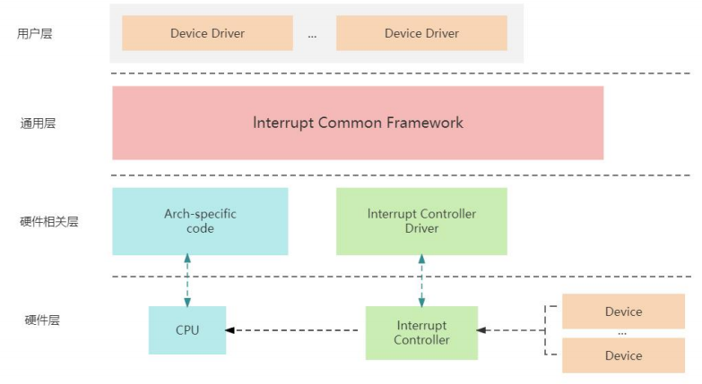
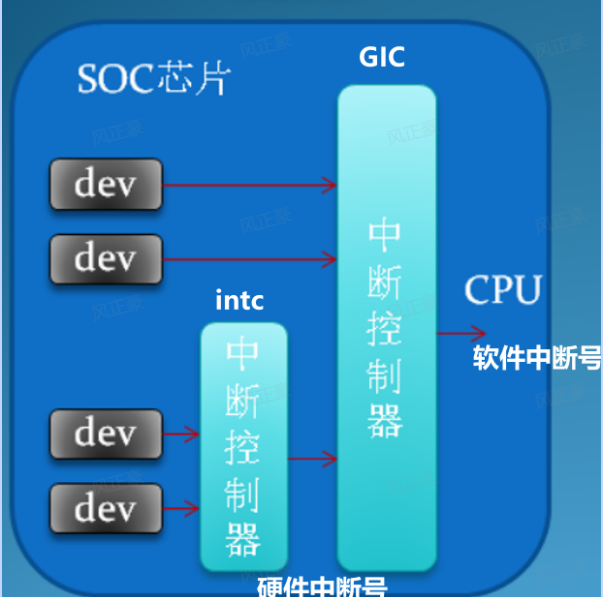
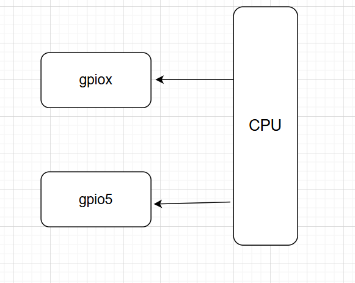
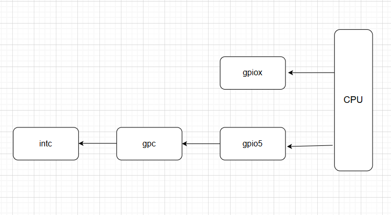
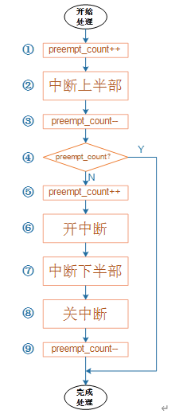

# 基础概念

## 中断作用

1. 中断是指 `CPU` 正常运行期间，由**外部（硬件中断）**和**内部（软中断）**事件引起的一种机制。
2. 中断机制赋予了我们处理意外情况的能力，如果我们能充分利用这个机制，将能够同时完成多个任务，从而**提高并发处理能力和资源利用率**。

## 中断的层级划分

1. 一个完整的中断子系统包括四个层次 : 

   - **用户层** : 该层是中断的使用者，主要**包含各类设备驱动，这些驱动程序通过中断相关 `API` 进行中断的申请和注册**。当外设触发中断时，用户层驱动程序也会进行相应的回调处理，执行特定的操作。**这一层是驱动工程师日常使用的**。
   - **通用层（框架层）** : 与硬件无关的层次。该层提供统一个接口和功能，用于管理和处理中断，使得驱动程序能够在不同的硬件平台上复用。**这一层主要是 Linux 内核开发者负责**。
   - **硬件相关层** : 该层包含两部分代码，处理器架构相关代码和中断控制器驱动代码。**这一层是原厂工程师负责**。
   - **硬件层** : 硬件层位于最底层，与具体的硬件连接相关。包含外设与 `SOC` 的物理连接。硬件层的设计和实现决定了中断信号的传递方式和硬件的处理能力。

   

## 抢占机制

1. `Linux` **不支持中断嵌套**。因为如果出现了突发事件，**多个中断短时间同时触发，会导致多层中断嵌套，栈会极速增大，最终栈溢出**。
2. 虽然 `Linux` 不支持中断嵌套，但是一些 **`GIC` 控制器会支持抢占**。如果低优先级任务已经进入了 `CPU` ，高优先级任务依旧只能等着。但是如果低优先级任务还没进入 `CPU` ，此时 `GIC` 又来了一个高优先级任务，最终 `GIC` 会将高优先级任务传递给 `CPU`。
3. 因此，我们可以得出结论 : 

   - 高优先级中断无法抢占**正在执行**的低优先级中断。
   - 都是处于 **`pending` 状态**的中断，优先级高的中断先执行。
   - **同优先级，同 `pending`** 状态，选择**硬件中断号 IO 最小**的一个发给 `CPU` 执行。

## 中断上下文

1. 中断执行需要快速响应，但并不是所有的中断都可以迅速完成。而 **`Linux` 中不支持中断嵌套，意味着正式处理中断前就会屏蔽其他的中断**，直到中断处理完成后才重新允许中断。
2. 如果**中断执行时间过长就会导致部分中断无法被响应，可能导致死机**。为了解决这个问题，中断分为上下段。上段执行时间短，且需要尽快执行的事情。下段为一些相对耗时较长的事情。
3. **上半部是不能被中断的，下半部可被中断**。
4. 上半部是由**硬件请求**，也就是我们常说的**硬中断**，特点是快速执行。下半部是由**内核触发**，也就是我们常说的**软中断**，特点是延迟执行。
7. 下半段可通过**软中断** ，**`tasklet`**，**工作队列**来实现的。**`tasklet` 是基于软中断实现的**。

## 三种下半部实现区别

| 特性       | 软中断（`Softirqs`）                                         | 任务（`Tasklet`）                                            | 工作队列（`Workqueues`）                   |
| ---------- | ------------------------------------------------------------ | ------------------------------------------------------------ | ------------------------------------------ |
| 执行上下文 | **中断上下文**中执行；**不能**调用可能**引起睡眠**的函数，**不建议**调用**引起阻塞的函数** | **中断上下文**中执行；**不能**调用可能**引起睡眠**的函数，**不建议**调用**引起阻塞的函数** | **进程上下文**；**可以进行阻塞等待和睡眠** |
| 并行性     | **向多个 `CPU` 注册，要考虑并发问题**                        | 向一个 `CPU` 注册                                            | 默认同一个 `CPU` 或指定 `CPU`              |
| 定义       | 软中断是**编译时静态定义**，运行时**不可以**进行添加或删除   | **`tasklet`** 支持静态定义，也可以通过 `tasklet_init` 动态初始化 | \                                          |
| 实时性     | 优秀                                                         | 良好                                                         | 较差                                       |
| 开销       | 最小                                                         | 比软中断多一点                                               | 最大                                       |
| 适用场景   | 软中断的**资源有限**，对应的中断号不多，一般用在**网络设备驱动**、**块设备驱动**当中 | 驱动开发，简单任务                                           | 复杂、耗时任务                             |

### 任务（`Tasklet`）

1. `Tasklets` 是一种基于**软中断（`Softirqs`）**的特殊机制，被广泛应用于中断下半部。
2. 它**在多核处理器上可以避免并发问题，因为 `Tasklet` 会绑定一个 `CPU` 执行**。
3. `Tasklet` 绑定的中断函数**不可以调用可能导致休眠的函数**，例如 `msleep()` ，否则会引起内核异常。
4. 虽然**不可以调用引起休眠的函数**，但**可以调用** `mdelay()` 通过消耗 `CPU` 实现的**纯阻塞延时函数**。不过依旧不建议在中断中调用延时函数，因为**中断要求快进快出**。
5. `tasklet` 可以静态初始化，也可以动态初始化。如果**使用静态初始化，那么就无法动态销毁**。因此在不需要使用 `tasklet` 时，应当避免使用此方法。

###   软中断（`Softirqs`）

1. 软中断是实现中断下半部的方法之一，但是因为**软中断资源有限**，对应的**中断号并不多**，所以一般都是用在了**网络驱动设备**和**块设备**中。
2. 软中断（`Softirqs`）是静态定义的，`Linux` 内核开发人员不希望驱动开发者新增软件中断类型。因此驱动开发者多数时候都是使用的 `tasklet` 作为中断下半部。
3. **软中断（`Softirqs`）更倾向与性能，可以在多个 `CPU` 并行执行，因此要考虑重入问题，适当时候需要加锁进行保护**。

### 工作队列（`Workqueues`）


## 中断号

1. 每个中断都有一个**软件中断号**（中断线，`IRQ Number`），通过中断号（中断线）可以区分不同中断，**在 Linux 内核中使用一个 int 变量表示中断号**。我们在驱动程序中利用中断号（中断线，`IRQ Number`）与指定的处理函数进行绑定。
2. 中断还有一个**硬件中断号**（`HW interrupt ID`），从驱动代码角度，我们只需要看中断号（中断线，`IRQ Number`）即可。但是**在设备树中配置的是硬件中断号（`HW interrupt ID`）**。所以在设备树中，我们需要设置**所属中断控制器**和 `IRQ` 号。

```dts
/{
    &uart1 {
        status = "okay";
        interrupts = <0 29 4>;  // 0 是中断控制器，29 是 IRQ 号，4 是触发方式
    };
};
```

3. 如果我们**只有一个中断控制器，软件中断号和硬件中断号是一一对应的**。但如果发生了如下这种**级联情况，那么就可能出现重复的硬件中断号**。如果 `CPU` 希望知道到底是那个中断事件，就还需要增加一个中断控制器的内容，通过**中断控制器**和**硬件中断号**配合在一起才可以知道到底是哪个中断。



3. **将硬件中断号和软件中断号进行分离的好处是 : 一旦中断相关的硬件发生变化，驱动程序无需再进行调整**。Linux 内核会帮我们做硬件中断号和软件中断号的映射。

## 未处理中断/虚假中断

1. **虚假中断**是指系统检测到中断信号，但实际上并没有发生需要处理的中断事件。换句话说，系统进入了中断服务例程（ISR），但 ISR 找不到任何需要处理的实际任务。发生虚假中断的情况 : 
   - **信号干扰**：由于电气噪声或其他硬件故障，设备可能误发中断信号。
   - **共享中断线**：多个设备共用一个中断线（如 `PCI` 总线中的共享 `IRQ`），一个设备中断处理完成后可能导致中断信号没有及时清除，从而误触发其他设备的中断。
   - **中断控制器问题**：某些中断控制器（如 8259 PIC）在处理低优先级中断时，可能会错误地生成虚假中断信号。
2. 虚假中断会导致**CPU 占用率上升，性能下降**的问题。
3. **未处理中断**是指系统检测到中断信号并进入中断上下文，但没有找到对应的中断处理程序（ISR）来处理这个中断。结果，中断信号未能被清除，可能会重复触发。
   - **未注册中断处理程序**：设备驱动程序未能正确注册中断处理程序，导致中断信号无法被识别。
   - **中断号错误**：驱动程序请求了错误的中断号（`IRQ`），导致实际中断发生时找不到对应的处理程序。
   - **驱动程序错误**：驱动程序未正确清除中断状态，导致中断被多次重复触发。
4. 未处理中断会导致**设备不可用**、**系统崩溃**、**中断风暴（未清除的中断信号可能反复触发）**。
5. 为了处理如上问题，`Linux kernel` 做了对应的保护 : 如果同一个 `IRQ` 触发了 100,000 次，但是其中的 99,900 次没有被处理，那么 `kernel` 就会自己将这条中断线 `disable` 。

# 设备树

1. 对于板级 `BSP` 工程师，我们只需要了解 `interrupt-parent` 和 `interrupts` 这两个特性。
2. 而对于芯片原厂的 `BSP` 工程师，则需要编写 `interrupts` ，`interrupt-controller` ，`#interrupt-cells` 这三个参数。

## 属性介绍

### interrupt-parent

1. 该参数用于建立**中断信号源**与**中断控制器**之间关联的属性，表明当前中断信号源所属的中断控制器节点，用以确保中断的处理与分发。如下例子中，标识当前的 `key@1` 节点与中断控制器 `gpio5` 相连接。

```dts
key@1 {
    compatible = "dts_key@1";
    interrupt-parent = <&gpio5>;
    //...
};
```



2. 如果 `interrupt-parent` 利用 `&` 包含了其他控制器，那么就会产生**级联**的效果。不过这仅需要了解即可，作为板级 `BSP` 工程师，**这些内容并不是由我们来编写，而是原厂工程师**。

```dts
intc: interrupt-controller@00a01000 {
    #interrupt-cells = <3>;
    //...
};

gpc: gpc@020dc000 {
    interrupt-controller;
    #interrupt-cells = <3>;
    // ...
};

soc {
    interrupt-parent = <&gpc>;
    //...
    aips1: aips-bus@02000000 {
        //...
        gpio5: gpio@020ac000 {
            interrupts = <GIC_SPI 74 IRQ_TYPE_LEVEL_HIGH>,
            <GIC_SPI 75 IRQ_TYPE_LEVEL_HIGH>;
            interrupt-controller;
            #interrupt-cells = <2>;
            //...
        };
    };
};
```



### interrupts

1. `interrupts` 属性中每个中断的中断编号单元数量是由 `#interrupt-cells` 来进行指定的。但是如果你对比过多家三星，NXP，瑞芯微的**板级 `BSP` 设备树**编写会发现**格式都是统一**的。 `#interrupt-cells` 都是2.
2. 这个是不是 `Linux` 内核规定的我就不太清楚了。不过这几家芯片原厂的格式统一都是如下，`IRQ_number` 标识要用哪个中断号，`IRQ_trigger_type` 表示要使用触发中断的方式。

| 类型               | 含义                                                         |
| ------------------ | ------------------------------------------------------------ |
| `IRQ_number`       | 标识要用哪个中断号                                           |
| `IRQ_trigger_type` | 触发方式，拥有类型 : <br />- `IRQ_TYPE_NONE` : **不依赖外部信号触发**。可能是定时器触发，也可是软件触发<br />- `IRQ_TYPE_EDGE_RISING` : 上升沿触发<br />- `IRQ_TYPE_EDGE_FALLING` : 下降沿触发<br />- `IRQ_TYPE_EDGE_BOTH` : 双边沿触发<br />- `IRQ_TYPE_LEVEL_HIGH` : 高电平触发<br />- `IRQ_TYPE_LEVEL_LOW` : 低电平触发 |

```dts
// 格式
interrupts = <IRQ_number IRQ_trigger_type>;

// IRQ_trigger_type 的定义，在 ${kernel}/include/dt-bindings/interrupt-controller/irq.h
#define IRQ_TYPE_NONE           0
#define IRQ_TYPE_EDGE_RISING    1
#define IRQ_TYPE_EDGE_FALLING   2
#define IRQ_TYPE_EDGE_BOTH      (IRQ_TYPE_EDGE_FALLING | IRQ_TYPE_EDGE_RISING)
#define IRQ_TYPE_LEVEL_HIGH     4
#define IRQ_TYPE_LEVEL_LOW      8


// 示例
gpio5: gpio@020ac000 {
            interrupt-controller;
            #interrupt-cells = <2>;
            //...
        };
key@1 {
    compatible = "dts_key@1";
    interrupt-parent = <&gpio5>;
    interrupts = <1 IRQ_TYPE_EDGE_FALLING>;
    //...
};
```

3. 但此时我们又会发现一个问题，为什么 `gpio5` 的 `interrupts` 属性有 3 个呢？这是因为它的父节点包含了 `gpc` ，而在 `gpc` 节点中 `#interrupt-cells = <3>;` 。不过这**些都不是我们板级 `BSP` 工程师要关心的事情了，这些工作应该是原厂工程师来做，我们简单了解即可**。

```dts
gpc: gpc@020dc000 {
    interrupt-controller;
    #interrupt-cells = <3>;
    // ...
};

soc {
    interrupt-parent = <&gpc>;
    //...
    aips1: aips-bus@02000000 {
        //...
        gpio5: gpio@020ac000 {
            interrupts = <GIC_SPI 74 IRQ_TYPE_LEVEL_HIGH>,
            <GIC_SPI 75 IRQ_TYPE_LEVEL_HIGH>;
            interrupt-controller;
            #interrupt-cells = <2>;
            //...
        };
    };
};
```

### #interrupt-cells

1. 通过上述 `interrupts` 属性的分析，我们也应该知道了 `#interrupt-cells` 属性作用。该属性就是用来描述每个中断信号源的中断编号单元的数量。
2. 一般来说，**不同层的 `#interrupt-cells` 为多少，`Linux` 都进行了规定和限制。作为原厂工程师和板级工程师我们只需要填坑即可**。

### interrupt-controller

1. `interrupt-controller` 属性用于**表示当前节点所描述的是一个中断控制器**。**该属性本身没有特定的属性值，只需要出现在属性列表中即可**。
2. 以下面为例子，我们存在 `gpio-controller;` 和 `interrupt-controller;` 两个属性。那么就表明**当前节点是中断控制器，同时也是一个 `GPIO` 控制器**。 

```dts
gpio1: gpio@0209c000 {
    compatible = "fsl,imx6ul-gpio", "fsl,imx35-gpio";
    reg = <0x0209c000 0x4000>;
    interrupts = <GIC_SPI 66 IRQ_TYPE_LEVEL_HIGH>,
    	<GIC_SPI 67 IRQ_TYPE_LEVEL_HIGH>;
    gpio-controller;
    #gpio-cells = <2>;
    interrupt-controller;
    #interrupt-cells = <2>;
};
```

## 获取属性信息 API

### irq_of_parse_and_map

1. 如果我们在设备树中配置 `interrupt-paren` 和 `interrupts`，那么我们就可以调用如下函数找到对应的中断号。
2. 这里需要注意，**一定要符合标准的 `interrupts = <IRQ_number IRQ_trigger_type>;` 属性写法！！！**

| 类型    | 描述                                                         |
| ------- | ------------------------------------------------------------ |
| 作用    | 解析设备树中的 `interrupts` 属性，并将对应的硬件中断号映射为软件中断号 |
| `node`  | 要进行解析的设备节点                                         |
| `index` | 索引号，要从 `interrupts` 属性中第几个中断获取中断号         |
| 返回值  | 成功时，返回一个映射后的软件中断号；失败返回0                |

```c
key@1 {
    compatible = "dts_key@1";
    interrupt-parent = <&gpio5>;
    interrupts = <1 IRQ_TYPE_EDGE_FALLING>;
    //...
};
unsigned int irq_of_parse_and_map(struct device_node *node, int index);
```

### irq_get_irq_data

1. 如果我们希望获取中断号的触发类型，就需要先调用该函数。

| 类型   | 描述                                                         |
| ------ | ------------------------------------------------------------ |
| 作用   | 获取与指定中断号（`IRQ`）相关的中断数据                      |
| `node` | 需要获取数据的中断号（`IRQ`），该值表示一个特定的中断资源    |
| 返回值 | 成功时，返回一个指向 `irq_data` 结构体的指针，表示该中断号的中断数据；失败返回 NULL |

```c
struct irq_data *irq_get_irq_data(unsigned int irq);
```

### irqd_get_trigger_type

1. 当我们获取了中断号（`IRQ`）相关的中断数据后，就可以调用该函数获取设备树中指定的中断类型了。

| 类型   | 描述                                                         |
| ------ | ------------------------------------------------------------ |
| 作用   | 获取获取指定中断的中断触发类型                               |
| `d`    | 要获取的中断触发类型的中断，传入一个指向 `irq_data` 结构体的指针 |
| 返回值 | 返回中断触发类型                                             |

```c
u32 irqd_get_trigger_type(struct irq_data *d);
```

2. 需要注意，**设备树中 `interrupts` 参数应当与 `request_irq` 中设置的中断触发类型一致，否则会可能出现如下报错 ！**因此我们需要使用当前的 `API` 获取设备树中设置的真实中断触发类型。

```shell
irq: type mismatch, failed to map hwirq-1 for /soc/aips-bus@02000000/gpio@020ac000!
```

### of_irq_get

1.  `of_irq_get()` 函数是对 `irq_of_parse_and_map` 的改进版，更适用于复杂或需要考虑延迟加载的场景。如果**你的应用场景涉及中断控制器可能存在延迟初始化问题，建议使用 `of_irq_get`**。 

```c
int of_irq_get(struct device_node *dev, int index)
{
	int rc;
	struct of_phandle_args oirq;
	struct irq_domain *domain;

	rc = of_irq_parse_one(dev, index, &oirq);
	if (rc)
		return rc;

	domain = irq_find_host(oirq.np);
	if (!domain)
		return -EPROBE_DEFER;

	return irq_create_of_mapping(&oirq);
}

unsigned int irq_of_parse_and_map(struct device_node *dev, int index)
{
	struct of_phandle_args oirq;

	if (of_irq_parse_one(dev, index, &oirq))
		return 0;

	return irq_create_of_mapping(&oirq);
}
```


# 中断 API 介绍

## 上半部

### gpio_to_irq

| 类型   | 描述                                                       |
| ------ | ---------------------------------------------------------- |
| 作用   | 将 `GPIO` 引脚编号转换成对应的中断请求号                   |
| `gpio` | 要映射的 `GPIO` 引脚号                                     |
| 返回值 | 成功时，返回与该 `GPIO` 引脚关联的 `IRQ` 编号;否则返回负数 |

```c
int gpio_to_irq(unsigned int gpio);
```

### request_irq/free_irq

1. 在 `Linux` 内核中，使用中断需要为其申请额外资源（如分配内存、初始化中断向量等），如果此时资源不可用，**`request_irq` 可能会睡眠，直到资源可用为止**。
2. 正因上面的原因，所以 `request_irq` 不能在**中断上下文**或者**其他禁止睡眠的代码段**中调用。
3. `request_irq` 是 Linux 内核中用于请求一个中断服务程序（Interrupt Service Routine, ISR）的函数，它**将一个中断号（IRQ）与一个指定的处理函数绑定**，以便在硬件中断发生时触发该处理函数。

| 类型      | 描述                                                         |
| --------- | ------------------------------------------------------------ |
| 作用      | 将中断号和指定处理函数进行绑定                               |
| `irq`     | 需要注册的中断号，用于标识中断源                             |
| `handler` | 指向中断处理程序的函数指针，当发生中断之后就会执行该函数     |
| `flags`   | 中断触发方式及其他配置，常见的标志 : <br /> - `IRQF_SHARED` : 共享中断。**多个设备共享一个中断线**，共享的所有中断都必须指定该标志，并且 `dev` 参数就是用于区分不同设备的唯一标识。<br />- `IRQF_ONESHOT` : **单次中断**，中断只执行一次。<br />- `IRQF_TRIGGER_NONE` : **不依赖外部信号触发**。可能是定时器触发，也可是软件触发。<br />- `IRQF_TRIGGER_RISING` : **上升沿触发**。<br />- `IRQF_TRIGGER_FALLING` : **下降沿触发**。<br />- `IRQF_TRIGGER_HIGH` : **高电平触发**。<br />- `IRQF_TRIGGER_LOW` : **低电平触发**。 |
| `name`    | 中断名称，用于标识中断，我们可以利用 `cat /proc/interrupts` 命令进行查看 |
| `dev_id`  | 如果 `flags` 被设置为了 `IRQF_SHARED`，该参数就是用于区分不同的中断。**该参数也将会被传递给中断处理函数 `irq_handler_t` 的第二个参数**。 |
| 返回值    | 申请成功返回0，否则为负数                                    |

```c
int request_irq(unsigned int irq, irq_handler_t handler,
                unsigned long flags, const char *name, void *dev);
```

4. 当我们需要注销之前通过 `request_irq()` 注册的中断处理程序，就可以调用如下函数。

| 类型     | 描述                                                         |
| -------- | ------------------------------------------------------------ |
| 作用     | 注销之前通过 `request_irq()` 注册的中断处理程序，并销毁中断注册时所产生的相关系统资源 |
| `irq`    | 需要注销的中断号                                             |
| `dev_id` | 如果该中断为共享中断，那么利用此参数区分具体中断，其值与 `request_irq()` 函数的最后一个参数 `dev_id` 一致。如果`request_irq()` 函数的最后一个参数 `dev_id` 传入值为 `NULL` ，那么这里也传入 `NULL` 即可。 |
| 返回值   | 无                                                           |

```c
void free_irq(unsigned int irq, void *dev_id);
```

### 中断服务程序（上半部）

| 类型     | 描述                                                         |
| -------- | ------------------------------------------------------------ |
| 作用     | `request_irq()` 注册的中断处理函数。**该函数为中断上半部**。 |
| `irq`    | 中断处理函数对应的中断号。因为**有可能多个中断共享一个中断处理函数，因此可以利用该参数进行区分不同的中断源**。 |
| `dev_id` | 与 `request_irq()` 函数的最后一个参数 `dev_id` 一致。**用于区分共享中断的不同设备，该参数也可以指向设备结构体**。 |
| 返回值   | 返回一个 `irqreturn_t` 类型参数，其内容如下 :<br />- `IRQ_NONE` : 中断未被处理<br />- `IRQ_HANDLED` : 中断已被成功处理<br />- `IRQ_WAKE_THREAD` : 还需要中断下半部进一步处理 |

```c
irqreturn_t handler(int irq, void *dev_id);

enum irqreturn {
	IRQ_NONE		= (0 << 0),
	IRQ_HANDLED		= (1 << 0),
	IRQ_WAKE_THREAD		= (1 << 1),
};

typedef enum irqreturn irqreturn_t;
```

## 下半部

### 任务（`Tasklet`）

#### DECLARE_TASKLET/DECLARE_TASKLET_DISABLED

1. 在 `Linux` 内核中存在一个静态初始化 `tasklet` 的宏函数，初始状态为使能。

| 类型   | 描述                                 |
| ------ | ------------------------------------ |
| 作用   | 静态初始化 `tasklet`，初始状态为使能 |
| `name` | `tasklet` 名称，用于标识当前中断     |
| `func` | 处理函数                             |
| `data` | 传递给处理函数的参数                 |

```c
#define DECLARE_TASKLET(name, func, data) \
struct tasklet_struct name = { NULL, 0, ATOMIC_INIT(0), func, data }
```

2. 如果希望初始状态为非使能，那么就可以使用下面这个宏。

```c
#define DECLARE_TASKLET_DISABLED(name, func, data) \
struct tasklet_struct name = { NULL, 0, ATOMIC_INIT(1), func, data }
```

#### tasklet_init/tasklet_kill

1. `tasklet_init()` 可以对 `tasklet` 动态初始化，为软中断准备好响应的下半部处理机制，并不会触发中断。
2. `request_irq()` 注册硬件中断处理程序，**执行完成后，就立即开始响应硬件中断信息**，并调用注册的中断处理函数。为了避免可能的**逻辑问题**或**未初始化数据被使用**，通常建议**先调用 `tasklet_init()`** 初始化好对应的 `tasklet` 资源，**再调用 `request_irq()`** 注册硬件中断。
3. `tasklet_init` 注册的函数中，**不可以调用可能引起休眠的函数**。但如果是 `mdelay()` 这种**单纯消耗 `CPU` 进行阻塞的延时函数，那么是可行的**，不过不建议。

| 类型   | 描述                         |
| ------ | ---------------------------- |
| 作用   | 对 `tasklet` 动态初始化      |
| `t`    | 指向 `tasklet_struct` 的指针 |
| `func` | `tasklet` 的处理函数         |
| `data` | 传递给处理函数的参数         |
| 返回值 | 无                           |

```c
void tasklet_init(struct tasklet_struct *t, void (*func)(unsigned long), unsigned long data);

// 示例
struct tasklet_struct mytasklet;
void mytasklet_func(unsigned long data)
{
    printk("data is %ld\n", data);
    // msleep(3000);
    mdelay(1000);
}

irqreturn_t test_interrupt(int irq, void *args)
{
    // ...
    tasklet_schedule(&mytasklet); // 调度tasklet执行
    // ...
}

static int __init interrupt_irq_init(void)
{
	// ...
    tasklet_init(&mytasklet, mytasklet_func, 1);
    ret = request_irq(irq, test_interrupt, IRQF_TRIGGER_RISING, "test", NULL);
	//...
}
```

4. 当我们不再需要使用一个 `tasklet` 时，可以调用如下函数进行注销。
5. 需要注意 : **该函数是阻塞的，会等待 `tasklet` 的当前执行完成**。因此**不建议**在中断上下文调用，因为它可能**导致内核等待**，进而引发不可预期的问题。

| 类型   | 描述                                                         |
| ------ | ------------------------------------------------------------ |
| 作用   | 注销一个已经初始化好的 `tasklet`<br />- 如果 `tasklet` 已被调度但尚未运行，`tasklet_kill` 会将其从调度队列中移除<br />- 如果 `tasklet` 当前正在运行，`tasklet_kill` 会等待其执行完成，然后再移除它，确保不会中途打断其执行 |
| `t`    | 指向 `tasklet_struct` 的指针                                 |
| 返回值 | 无                                                           |

```c
void tasklet_kill(struct tasklet_struct *t);
// 示例
static void __exit interrupt_irq_exit(void)
{
  // ...
  free_irq(irq, NULL);
  tasklet_kill(&mytasklet);
  // ...
}
```

#### tasklet_schedule

1. 该函数会将指定的 `tasklet` **标记为待执行(`pending`)**，并将其添加到内核的软中断队列中。
2. 调用 `tasklet_schedule()` 函数只是标记为**待执行(`pending`)**，因此**不会立刻执行**对应的 `tasklet` 的处理函数。**实际的执行时间取决与内核的调度和处理机制**。

| 类型   | 描述                                                         |
| ------ | ------------------------------------------------------------ |
| 作用   | 将指定的 `tasklet` 标记为待执行(`pending`)，并将其添加到内核的软中断队列中 |
| `t`    | 指向 `tasklet_struct` 的指针                                 |
| 返回值 | 无                                                           |

```c
void tasklet_schedule(struct tasklet_struct *tasklet);
```

#### tasklet_disable/tasklet_enable

1. **暂时禁用**指定的 `tasklet`，这意味着即使我们调用 `tasklet_schedule()` 函数来调度该 `tasklet` 已经被调度，也不会被执行。

| 类型   | 描述                         |
| ------ | ---------------------------- |
| 作用   | 暂时禁用指定的 `tasklet`     |
| `t`    | 指向 `tasklet_struct` 的指针 |
| 返回值 | 无                           |

```c
void tasklet_disable(struct tasklet_struct *tasklet);
```

2. 当一个 `tasklet` 被暂停使用，现在我们希望重新启动该 `tasklet` 运行，那么可以调用如下函数。

| 类型   | 描述                         |
| ------ | ---------------------------- |
| 作用   | 启用被暂时禁用的 `tasklet`   |
| `t`    | 指向 `tasklet_struct` 的指针 |
| 返回值 | 无                           |

```c
void tasklet_enable(struct tasklet_struct *t);
```

### 软中断

#### open_softirq


#### raise_softirq


#### raise_softirq_irqoff


### 工作队列（`Workqueues`）


# 调试

## debug
### 硬中断

1. 当 `gpio` 作为外部中断使用时，调用 `cat /proc/interrupts` 命令可以查看**所有硬中断的相关信息** :
   - `CPU0` : 表示在哪个 `CPU`  核心上处理。
   - 16 : 软件中断号（`IRQ Number`）。**软件中断号是唯一的**，内核通过这个标识找到对应的中断处理程序。
   - 106214 : 中断号对应的中断在 `CPU0` 上被触发的总次数。例如，中断号 16 被触发了 106,214 次。
   - `GPC` : 表示中断控制器的类型。在这里，`GPC` 是一个中断控制器的名字，可能与特定硬件平台相关。它负责将硬件中断请求映射到内核。
   - 55 : 表示硬件中断信号（`HW interrupt ID`），这是特定平台中断控制器的内部编号。
   - `Level` : 触发类型。`Level` 表示电平触发，`Edge` 表示边沿触发。
   - `i.MX Timer Tick` : 表示中断对应的功能或设备。常见的设备名称包括定时器、串口、SPI 控制器等。在这里，`i.MX Timer Tick` 是一个定时器中断，用于系统时钟调度。

```shell
$ cat /proc/interrupts 
           CPU0       
 16:     106214       GPC  55 Level     i.MX Timer Tick
 18:          0       GPC  31 Level     2008000.ecspi
 19:          0       GPC  33 Level     2010000.ecspi
 20:        315       GPC  26 Level     2020000.serial
```

### 软中断

1. `cat /proc/soft` 可以查看各种**软中断**在不同的 `CPU` 上累计的运行次数。

```shell
$ cat /proc/softirqs 
                    CPU0       
          HI:          3
       TIMER:       1424
      NET_TX:         10
      NET_RX:        137
       BLOCK:          0
    IRQ_POLL:          0
     TASKLET:       1446
       SCHED:          0
     HRTIMER:          0
         RCU:       2568
```

## 性能优化

### 亲缘绑定

1. `/proc/irq/` 目录中存放着**以软件中断号命名的文件夹**，每个中断号文件夹下都有几个节点，这些节点存放对应中断号的信息。我们一般看 **`smp_affinity` 节点，该节点代表中断号与 `CPU` 之间的亲缘绑定关系**。如果某个中断号绑定了一个 `CPU` 核，那么这个中断就会一直在这个 `CPU` 上处理。利用该节点，我们可以让性能进行优化，使得空闲 `CPU` 忙起来。

```shell
$ cat /proc/irq/44/smp_affinity
1
```

2. 我们可以通过串口对该参数进行赋值，不过重启之后就会消失。
3. 我们也可以**通过 `irq_set_affinity()` 函数指定中断掩码，最终实现将某个中断被固定到指定的 `CPU` 运行**。

### 均衡负载

1. 当我们调用 `cat /proc/soft` 查询软中断在不同的 `CPU` 执行情况时，在不同的 `CPU` 上累计应当差不多。

## 中断唤醒系统

1. `Linux` 内核 


# 面试题

## 上下文的概念是什么

1. 上下文是**指程序或者系统当前所处的执行环境和状态**，它包括了**程序的状态、寄存器值、内存映射、文件描述符、信号处理器等信息**。上下文是一个抽象的概念，它描述了程序或者系统的执行环境和运行状态。
2. **上文（Context of the Process/Thread Before）** : **用于保存当前任务运行状态**，操作系统需要保存的全部寄存器值、程序计数器（PC）、堆栈指针等。
3. **下文（Context of the Process/Thread After）** : **恢复任务时的状态信息，通常是从保存的“上文”中恢复的内容**。

## Linux 中存在几种上下文

2. 在 `Linux` 中通常分为**中断上下文**和**进程上下文**。
2. **中断上下文**又分为**硬中断上下文**和**软中断上下文**。
3. 一个进程的上下文可以分为三个部分 : **用户级上下文**、**寄存器上下文**以及**系统级上下文**。

   - **用户级上下文** : 正文、数据、用户堆栈以及共享存储区；
   - **寄存器上下文** : 通用寄存器、程序寄存器(`IP`)、处理器状态寄存器(`EFLAGS`)、栈指针(`ESP`)；
   - **系统级上下文** : 进程控制块 `task_struct`、内存管理信息(`mm_struct`、`vm_area_struct`、`pgd`、`pte`)、内核栈。

## 中断上下文和进程上下文的区别

1. 

## 中断上半部、下半部关系

5. **同一个中断上半部和下半部是多对一的关系**。
2. 因为中断下半部是可以被中断的，当中断**刚执行到步骤7**时，**同样的中断**又发生了一次，那么就会跳转到步骤1。然后执行到步骤4，发现 `preempt_count` 不是0，那么**第二次中断的中断下半部不会被执行，而是返回恢复中断线程，也就是第一次中断的终端下半部**。



## 为什么中断上下文不允许休眠

2. **所谓睡眠就是调用 `schedule` 函数让出 `CPU`** ，使其执行其他任务，**这个过程涉及到进程栈空间的切换**。
3. 如果是进程A发生中断，而在中断上下文中又调用 `schedule` 函数进行了调度，变成进程B。那么此时**进程A的上下文信息将会被进程B的内容覆盖，从而导致无法回到进程A**。
3. 因为中断上半部是处于关中断状态。当我们调用睡眠函数时，**睡眠函数会调用 `schedule` 函数让出 `CPU`**，进而去执行其他进程。**而中断一直处于关闭状态，无法 Linux 内核无法进行正常的调度行为，从而系统崩溃**。

## 为什么进程上下文可以休眠

1. 

## 中断上下文有那些注意事项

1. **不能调用可能引起阻塞等待的 `API`** 。
2. **不能尝试获取信号量**。因为信号量会引起睡眠。
3. **不能执行耗时的任务**。因为中断上下文是禁用中断，如果长时间处于中断上下文，会导致内核大量的服务和请求无法被响应，严重影响系统功能。
4. **不能访问虚拟内存**。因为中断在内核空间。

## 用户态到内核态的几种方式

1. **系统调用** : 当我们执行 `open()` 、`read()`、 `write()`**操作文件**，调用 `fork()` **创建进程**，`malloc()` **分配内存**都将会进行用户态到内核态的转变。
2. **中断** : 触发中断，操作系统会暂时中断当前执行的用户态程序，转而处理该中断请求。
3. **异常** : 异常触发时，处理器会将程序的执行转移到操作系统内核态，操作系统会进行处理，比如抛出信号、终止进程等。

## 为什么中断号会稀疏，不连续情况

1. 如果只有**一个 `CPU` ，一个中断控制器**，我们可以保证物理中断信号到虚拟中断号的映射是线性的，这样可以使用**数组**进行表示并没有问题。
2. 但如果是**多个 `CPU` ，多个中断控制器**，就没有办法保证虚拟中断信号是连续的，因此需要使用到**基数树**。
   - 在多 CPU 和多中断控制器的情况下，不同中断控制器管理的中断号可能存在以下问题：
     - **非连续映射**：每个中断控制器的中断号范围可能不同，并且在多个控制器之间可能存在“稀疏”分布。例如：控制器 A 管理中断号 `0-31`。控制器 B 管理中断号 `100-131`。之间存在较大间隙
     - **动态分配**：稀疏分布导致**无法预先知道要获取的内存**。如果使用**数组**可能存在**大量空槽，浪费空间和查找效率**。
   - **基数树**是一种高效的数据结构，特别**适合稀疏键空间**。它通过**路径压缩**和**前缀匹配机制**，解决了中断号稀疏和不连续的问题。
     - **节省存储空间**：基数树只存储有效的中断号路径，不用为空闲的中断号分配存储空间。
     - **支持稀疏键空间**：基数树能够高效地存储和查找稀疏分布的中断号。
     - **灵活性**：基数树支持动态插入和删除中断号映射，非常适合动态分配中断号的场景。