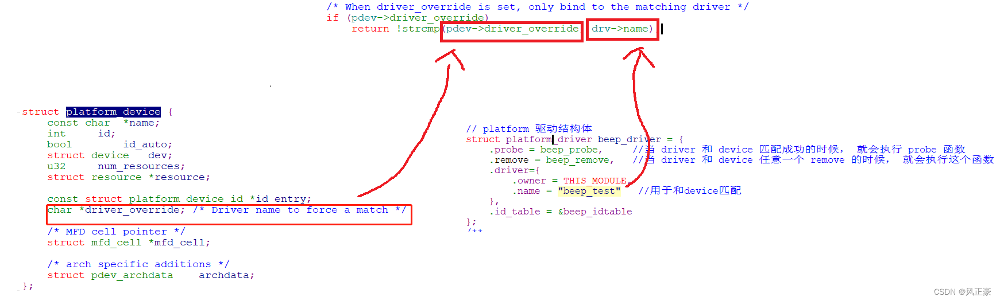
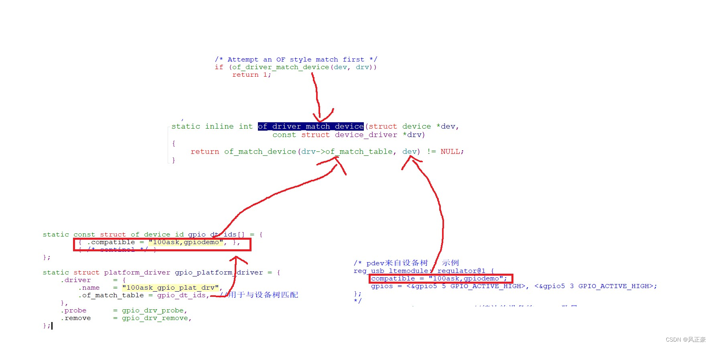
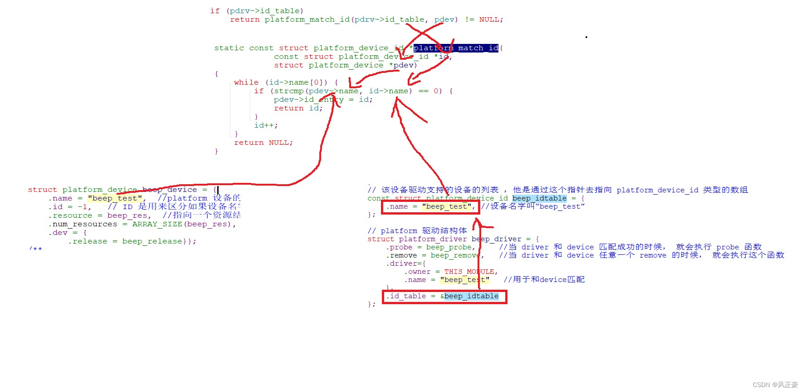
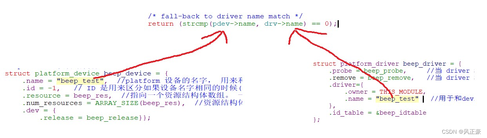

# 术语

| 术语   | 解释                                                         |
| ------ | ------------------------------------------------------------ |
| `DTS`  | 设备树源文件，用于描述设备硬件的结构、属性和连接关系         |
| `DTSI` | 设备树源文件的包含文件，它扩展了 `DTS` 文件的功能，**用于定义可复用的设备树片段，与 C 语言的头文件作用相同**；我们使用某款芯片制作出了自己的单板，所用资源跟 `xxxx.dtsi` 是大部分；**语法和 `DTS` 文件完全一致** |
| `DTB`  | 相同，小部分不同，所以需要引脚 `xxxx.dtsi` 并修改设备树的二进制文件，通过将 `DTS` 和 `DTSI` 文件编译而成的二进制文件。被操作系统加载和解析，运行时，操作系统利用 `DTB` 文件动态识别和管理硬件设备 |
| `DTC`  | 设备树的编译器，将 `DTS` 和 `DTSI` 编译成 `DTB`              |

# 设备树基础

## 设备树与平台总线的关系

1. 设备树替换了平台总线模型中的 `device` 部分，所以**设备树也是对硬件资源进行描述的文件**。平台总线模型中，`device` 部分用  `platform_device` 结构体描述硬件。所以内核最终也将认识的 `device_node` 转换成 `platform_device` 。

## 如何在驱动代码中区分匹配的是平台总线还是设备树

1. 当驱动和设备匹配成功后，我们可以查看 `platform_device.dev.of_node` 成员是否为空值。如果该值不是空指针，那么表示匹配的是设备树，否则匹配的是平台总线。

```c
static int gpio_drv_probe(struct platform_device *pdev)
{
	struct device_node *np = pdev->dev.of_node;
    if (np) { // 成功匹配设备树
    	// ...
    } else { // 成功匹配平台总线
        // ...
    }
}
```

## 设备树在文件系统中的体现

1. 进入内核路径的 `arch/arm/boot/dts` 目录中都是设备树的源码。**该路径是指 PC 端 Linux 内核存放路径！**
2. `/sys/firmware/devicetree/base/` 目录下是以目录结构程现的 `dtb` 文件, **根节点对应 `base` 目录, 每一个节点对应一个目录, 每一个属性对应一个文件**。**如下命令是在开发板上执行！**

```shell
$ ls /sys/firmware/devicetree/base/
'#address-cells'   chosen       gpio-keys                       model       regulators        sound
'#size-cells'      clocks       interrupt-controller@00a01000   motor_zys   reserved-memory   spi4
 aliases           compatible   leds                            name        sii902x-reset
 backlight         cpus         memory                          pxp_v4l2    soc
```

4. **这些属性的值如果是字符串，可以使用 `cat` 命令把它打印出来；对于数值，可以用 `hexdump` 把它打印出来**。

```shell
# dts 文件
    motor_zys {
    compatible = "100ask,gpiodemo";
    gpios = <&gpio4 19 GPIO_ACTIVE_HIGH>, 
            <&gpio4 20 GPIO_ACTIVE_HIGH>,
            <&gpio4 21 GPIO_ACTIVE_HIGH>,
			<&gpio4 22 GPIO_ACTIVE_HIGH>;
    };
# 开发板
$ cd /sys/firmware/devicetree/base/motor_zys/ 
$ ls 
compatible  gpios  name
$ hexdump gpios 
0000000 0000 0900 0000 1300 0000 0000 0000 0900
0000010 0000 1400 0000 0000 0000 0900 0000 1500
0000020 0000 0000 0000 0900 0000 1600 0000 0000
0000030
$ cat name 
motor_zys
$ cat compatible 
100ask,gpiodemo
```

## 绑定文档

1. 设备树是用于描述板子上的设备信息的，但是**不同的芯片对设备的描述信息是不同的，反映到设备树中的属性值也是不同的**。
2. 如果我们需要在设备树中查看一个硬件节点的相关信息时，就可以进入 `Linux` 内核源码中的 `Documentation/devicetree/bindings` 路径进行查看相关内容。
3. **如果在该目录下查找不到对应的文档信息，那么说明该信息是处于保密状态，因此需要咨询芯片原厂签保密协议获取**。

## dtb 何时转换成内核可识别设备树

`uboot` 将内核和设备树加载到内存的某个地址上，**内存在初始化的时候会将加载到内存里面的 `dtb` 文件展开成内核可以识别的设备树。**

## 节点转换为 `platform_device` 规则

1. 并不是所有的节点都将被转换成 `platform_device` ，只有满足条件的才会被转换成 `platform_device` ，转换成  `platform_device` 的节点可以在 `/sys/bus/platform/devices` 中查看。

```shell
# 开发板中
$  ls /sys/bus/platform/devices
 1804000.dma-apbh           20c8000.anatop                         2188000.ethernet     'Vivante GCCore'
 2000000.aips-bus           20c8000.anatop:regulator-3p0@120       2190000.usdhc         alarmtimer
 2000000.aips-bus:tempmon   20c8000.anatop:regulator-vddcore@140   2194000.usdhc         backlight
 2000000.spba-bus           20c8000.anatop:regulator-vddsoc@140    2198000.adc           ci_hdrc.0
 2008000.ecspi              20c9000.usbphy                         21a0000.i2c           ci_hdrc.1
```

2. 如下为转换规则 : 

- 根节点下包含 `compatible` 属性的子节点。

- 如果节点中  `compatible` 属性中包含 `simple-bus`、`simple-mfd`、`isa`、`arm,amba-bus` 中四者之一，那么它的子节点( 需含 

  `compatile` 属性)也可以转换为 `platform_device` 。

- 节点还需要有一个有效的状态属性（`status`），并且该属性的值必须是 `okay` 。如果没有设置 `status` 那么系统默认为  `okay` 。

- 总线 `I2C`、`SPI` 节点下的子节点不会转换成 `platform_device` 。

3. `platform_device` 中含有 `resource` 数组, 它来自 `device_node` 的 `reg`、 `interrupts` 属性；`platform_device.dev.of_node` 指向 `device_node`, 可以通过它获得其他属性。

## 匹配规则

### 源码

1. 每次注册驱动或者设备时，都将会触发 `platform_match()` 函数。从如下代码可知，**驱动和设备是有5条匹配规则的**。
2. 从变量名我们可以知道如下信息 : 
   - `dev = platform_device`
   - `dev = platform_device.dev`
   - `pdrv = platform_driver`
   - `drv = platform_driver.driver`

```c
static int platform_match(struct device *dev, struct device_driver *drv)
{
	struct platform_device *pdev = to_platform_device(dev);
	struct platform_driver *pdrv = to_platform_driver(drv);

	/* When driver_override is set, only bind to the matching driver */
	if (pdev->driver_override)
		return !strcmp(pdev->driver_override, drv->name);

	/* Attempt an OF style match first */
	if (of_driver_match_device(dev, drv))
		return 1;

	/* Then try ACPI style match */
	if (acpi_driver_match_device(dev, drv))
		return 1;

	/* Then try to match against the id table */
	if (pdrv->id_table)
		return platform_match_id(pdrv->id_table, pdev) != NULL;

	/* fall-back to driver name match */
	return (strcmp(pdev->name, drv->name) == 0);
}
```

### 规则一

如果平台总线中的 `platform_driver.driver_override`  被赋值，那么就**强制选择特定的驱动程序来匹配平台设备**。



### 规则二

1. 与设备树进行匹配，让**驱动代码** `platform_driver.driver.of_match_table` 与**设备树**的 `compatible`、`device_type`、`name` 属性进行匹配。
2. 匹配成功返回 1，否则继续匹配。
3. 需要注意：**设备树中建议不再使用 `devcie_type` 和 `name` 属性，所以基本上只使用设备节点的 `compatible` 属性来寻找匹配的 `platform_driver`。**




### 规则三

`ACPI` 主要用于 `x86` 架构的传统 `PC` 平台，特别是在桌面和笔记本电脑上。它较为复杂，包含了丰富的系统管理和电源管理功能。**开发人员无法修改，只能由主板供应商修改 `BIOS` 固件。**

### 规则四

**如果 `platform_driver.id_table` 被赋值，那么后面的就不会再进行匹配，否则进行规则五的规则而匹配**。这个就是平台总线中设备代码 `platform_driver.id_table.name` 是否和驱动代码 `platform_device.name` 。



### 规则五

**当平台总线中 `platform_device.driver_override` 和 `platform_driver.id_table` 成员变量都没有被定义，同时设备树也都没有匹配成功，才会到这里**。这条规则非常简单，就是看平台总线模型中设备 `platform_device.name` 是否和驱动 `latform_driver.driver.name` 匹配。



# 编译
## 利用 DTC 编译与反编译

1. 在内核源码的 `scripts/dtc/` 路径中我们可以找到 `dtc` 编译器的源码。当我们编译源码时候，`dtc` 的源码也会被编译，最终会产生 `dtc` 的可执行文件。
2. 如果我们编译了内核源码，但是发现没有`dtc` 的可执行文件。那么就需要进行内核的根目录，找到 `.config` 文件配置 `CONFIG_DTC` 是否为 y。如果内核版本较低，那没有 `dtc`。

```c
# 编译
# -I : 表示输入，后面紧跟 dts 表示输入文件格式为 dts 文件
# -O : 表示输出，后面紧跟 dtb 表示最终要输出 dtb 格式文件
# -o : 最终输出的文件名字 + 要编译的设备树源码
dtc -I dts -O dtb -o output.dtb input.dts
# 反编译
dtc -I dtb -O dts -o output.dts input.dtb
```

## 将修改设备树的结果编译进开发板

1. 增加设备树的方法，我们可以找到内核目录下的 `arch/arm/boot/dts/xxx.dts` 单板文件，不同的板子单板文件不同，例如我是韦东山老师的 `i.max6ull pro` 开发板，因此单板文件为   `arch/arm/boot/dts/100ask_imx6ull-14x14.dts` 。

```shell
PC:
# 1. 进入内核目录
cd ${Linux-4.9.88}
# 2. 找到对应的 dts 文件进行修改
vim ./arch/arm/boot/dts/100ask_imx6ull-14x14.dts
# 3. 申明环境变量
export ARCH=arm
export CROSS_COMPILE=arm-buildroot-linux-gnueabihf-
export PATH=$PATH:/home/book/100ask_imx6ull-sdk/ToolChain/arm-buildroot-linux-gnueabihf_sdk-buildroot/bin
# 4. 进行编译
make dtbs
# 5. 将编译完成的 dtb 文件复制到开发板中
cp arch/arm/boot/dts/100ask_imx6ull-14x14.dtb ~/nfs_rootfs/

开发板:
# 1. 挂载文件系统
mount -t nfs -o nolock,vers=3 192.168.5.11:/home/book/nfs_rootfs /mnt
# 2. 将 dtb 文件复制到 /boot 目录中
cp /mnt/100ask_imx6ull-14x14.dtb  /boot
# 3. 重启
reboot
```

2. 一个板子有多个 `DTS` 文件，如何知道编译哪一个 `DTS`？我们以 `I.MAX6ULL` 为例，进入  `arch/arm/boot/dts/Makefile` 目录可以看到如下内容。其中 `100ask_imx6ull-14x14.dtb` 、`100ask_imx6ull_mini.dtb` 、`100ask_myir_imx6ull_mini.dtb` 为百问网移植Linux系统时添加的设备树文件。
3. 如果我们需要以 `I.MAX6ULL` 做一个新的板子，那么只需要新建一个 `.dts` 文件即可。

```dts
dtb-$(CONFIG_SOC_IMX6ULL) += \
	imx6ull-14x14-ddr3-arm2.dtb \
	imx6ull-14x14-ddr3-arm2-adc.dtb \
	imx6ull-14x14-ddr3-arm2-cs42888.dtb \
	imx6ull-14x14-ddr3-arm2-ecspi.dtb \
	imx6ull-14x14-ddr3-arm2-emmc.dtb \
	imx6ull-14x14-ddr3-arm2-epdc.dtb \
	imx6ull-14x14-ddr3-arm2-flexcan2.dtb \
	imx6ull-14x14-ddr3-arm2-gpmi-weim.dtb \
	imx6ull-14x14-ddr3-arm2-lcdif.dtb \
	imx6ull-14x14-ddr3-arm2-ldo.dtb \
	imx6ull-14x14-ddr3-arm2-qspi.dtb \
	imx6ull-14x14-ddr3-arm2-qspi-all.dtb \
	imx6ull-14x14-ddr3-arm2-tsc.dtb \
	imx6ull-14x14-ddr3-arm2-uart2.dtb \
	imx6ull-14x14-ddr3-arm2-usb.dtb \
	imx6ull-14x14-ddr3-arm2-wm8958.dtb \
	imx6ull-14x14-evk.dtb \
	imx6ull-14x14-evk-btwifi.dtb \
	imx6ull-14x14-evk-btwifi-oob.dtb \
	imx6ull-14x14-evk-emmc.dtb \
	imx6ull-14x14-evk-gpmi-weim.dtb \
	imx6ull-14x14-evk-usb-certi.dtb \
	100ask_imx6ull-14x14.dtb \
	100ask_imx6ull_mini.dtb \
	100ask_myir_imx6ull_mini.dtb \
	imx6ull-9x9-evk.dtb \
	imx6ull-9x9-evk-btwifi.dtb \
	imx6ull-9x9-evk-btwifi-oob.dtb \
	imx6ull-9x9-evk-ldo.dtb
```

# 设备树语法

## 基础语法

### 基础构成

1. 如下为一个最简单的根节点示例。**根节点（Root Node）是整个设备树的起始点和顶层节点**，根节点由一个以 `/` 开头的标识符来表示，然后使用 `{}` 来包含根节点所在的内容。
2. 文件头并不是强制要求加上 `/dts-v1/;` 。但**为了避免不必要的兼容性问题，并确保设备树的正确解析，建议始终在设备树的开头加上该标记**。如果遇到语法错误或不确定的行为，确保使用此标记。

```dts
/dts-v1/;

/ { // 根节点
};

```

3. 设备树**子节点**格式。
   - 节点标签（Label）（**可选**）：**标签允许其他节点直接引用此节点**，以便在设备树中建立引用关系。**通俗来说，就是别名/小名/外号**，例如求生专家贝尔格里尔斯，我们称为贝爷。贝尔格里尔斯是节点名称，贝爷是节点标签。
   - 节点名称（Node Name）（**必选**）：节点名称**是一个字符串**，用于唯一标识该节点在设备树中的位置。节点名称通常是硬件设备的名称，但必须**在设备树中是唯一**的。名称要非常直观的体现硬件的类型。**长度不能超过31个字符！**
   - 单元地址（Unit Address）（**可选**）：单元地址用于标识设备的实例。**单元地址对于驱动程序而言是没有实际意义的，只是用于让节点名称更加人性化，更方便阅读**。

```dts
[label:] node-name@[unit-address] {
    [properties definitions]
    [child nodes]
};
```

4. 同级下的节点名不能相同， 不同级下的节点名可以不同。

```dts

/dts-v1/; // 版本一定要写，否则编译会报错

/ { // 根节点
	node1{
		node1{ // 可行，因为两个node1处于不同级别
		
		};
	};
	node1{ // 不可行，因为两个node1处于同一级
		node2_child{
		
		};
	};
};
```

### 头文件

1. 在 `dts` 文件中，我们可以包含 `dtsi` 文件，因为 `dtsi` 文件通常包含**某个芯片、`SoC` 或开发板的通用配置**，供多个设备树文件共享。
2. 但同时我们也可以包含 `.h` 文件，该文件主要用于定义符号常量或宏，用于设备树文件中的值替代或配置。它类似于 C 语言中的头文件，**用来避免硬编码，提高代码可读性和可维护性**。

```dts
// 包含头文件
#include <dt-bindings/input/input.h>
// 包含 dtsi 文件
#include "imx6ull.dtsi"

// imx6ull-pins.h 文件
#define GPIO1_IO00 0x10B0 /* GPIO1_IO00 的配置值 */
#define GPIO_ACTIVE_HIGH 1
#define GPIO_ACTIVE_LOW  0
// DTS 文件
#include "imx6ull-pins.h"

leds {
    compatible = "gpio-leds";
    led0 {
        label = "status-led";
        gpios = <&gpio1 GPIO1_IO00 GPIO_ACTIVE_HIGH>;
    };
};

```

### 追加节点

1. 在产品开发中可能面临频繁的需求修改，例如第一版硬件上有一个 `I2C1` 接口的六轴芯片 `MPU6050`，但第二版硬件又要把这个 `MPU6050` 更换成 `MPU9250` 。一旦修改了硬件，那么我们就需要同步修改设备树文件。
2. 但是 `I2C1` 节点相关信息是存放在 `dtsi` 文件中，而 `dtsi` 文件又是用于存储通用配置信息的，因此新追加的节点信息肯定不能放在 `dtsi` 文件中。

```dts
i2c1: i2c@021a0000 {
    #address-cells = <1>;
    #size-cells = <0>;
    compatible = "fsl,imx6ul-i2c", "fsl,imx21-i2c";
    reg = <0x021a0000 0x4000>;
    interrupts = <GIC_SPI 36 IRQ_TYPE_LEVEL_HIGH>;
    clocks = <&clks IMX6UL_CLK_I2C1>;
    status = "disabled";
};

```

3. 利用 `&labe` 的方式进行节点追加。

```dts
&i2c1 {
	// ...
};
```


## 常用的属性

### compatible

1. `compatible` 属性是一个关键字段，**用于标识设备类型并匹配驱动程序或操作系统内核中相应的设备支持逻辑**。它是设备树中设备描述的核心，帮助操作系统找到并加载正确的驱动程序。
2. `compatible` 通常是一个以字符串为单位的数组，按**优先级从高到低排列**。
3. 我们可以**利用该字段指定设备属于什么类别或厂商**。
4. **根节点中必须包含该`compatible` 属性**，否则内核无法找到对应的驱动程序进行初始化，导致程序崩溃。
5. 具体写法如下：

```dts
# 设备的制造商，通常使用小写字母;例如 arm: ARM 公司 、 ti: 德州仪器
# 设备型号通常也是使用小写字母；例如 pl011: PL011 UART 控制器 、 imx6q-sdma: i.MX6Q 系列的 SDMA 控制器
# 厂商标识和设备名称之间用逗号分隔，例如："ti,am335x-gpio"
compatible = "厂商,设备型号", "通用设备类别";
# 示例
# "arm,pl011"：指定该设备为 ARM 的 PL011 UART 控制器，这是设备的具体型号
# "arm,primecell"：表示该设备符合通用的 PrimeCell UART 标准，是更宽泛的兼容描述
# 系统会优先匹配 "arm,pl011"，如果找不到对应的驱动程序，则会匹配 "arm,primecell"
soc {
    uart0: serial@101f1000 {
        compatible = "arm,pl011", "arm,primecell";
        reg = <0x101f1000 0x1000>;
    };
};

```

5. 多个 `compatible` 意义：
   - 支持新设备的同时兼容旧设备
   - 指定特定型号的设备，同时声明其符合某个通用标准
6. **厂商和设备命名的格式并没有强制性**，但建议遵循设备树文档中厂商前缀的命名规则，保持一致性。

### model

1. `model` 属性用于描述一个节点的名称，通常**提供人类可读的设备或系统的模型信息**。
2. 它**通常用于根节点（`/`，即顶层节点）来标识整个硬件系统或平台**，但在某些子节点中也可能出现，用于进一步描述特定设备的型号。
3. **与 `compatible` 不同，`model` 通常不直接参与驱动程序匹配，更多是为了文档化和调试方便。`compatible`：提供与驱动程序匹配的设备描述，而 `model` 的作用更偏向文档和识别。**
4. **操作系统在加载设备树时，会读取 `model` 属性用于调试和信息展示，硬件验证工程师可以利用该信息确认是否加载了正确的设备树文件**。例如，Linux 内核会在启动日志中打印设备树中 `model` 的值：

```shell
$ dmesg | grep "Machine model"
[    0.000000] OF: fdt:Machine model: Freescale i.MX6 ULL 14x14 EVK Board
```

### status

1. `status` 属性用于指示某个节点的状态。它是一个标准的设备树属性，通常用于启用或禁用设备，或者标明设备是否可用。**内核和驱动程序通过解析该属性来决定是否加载某个设备的驱动或配置**。
2. **如果没有设置 `status` 属性，则默认视为 `okay`，即设备处于启用状态**。

| 值       | 含义                                                         |
| -------- | ------------------------------------------------------------ |
| okay     | 设备或节点可用，内核会尝试加载驱动并初始化                   |
| disabled | 设备不可用，但后续可以恢复工作                               |
| reserved | 设备虽然可以正常运行，但不应被使用，通常用于硬件保留或调试用途 |
| fail     | 设备加载失败或者不可用                                       |
| fail-sss | 设备加载失败或者不可用，sss 表示错误信息                     |


## 常见节点

### 根节点

每个 `dts` 文件中必须有一个根节点，而**根节点中必须有如下内容**：

| 属性            | 功能                                                         |
| --------------- | ------------------------------------------------------------ |
| compatible      | 标识设备或平台的兼容性信息，用于内核匹配适配的驱动程序       |
| model           | 人类可读的硬件模型描述，通常用于识别设备平台，便于调试和文档化 |
| \#address-cells | 在它的子节点的 reg 属性中, 使用多少个 u32 整数来描述地址(address) |
| #size-cells     | 在它的子节点的 reg 属性中, 使用多少个 u32 整数来描述大小(size) |

### memory 节点

1. **`memory` 节点用于描述系统的物理内存信息，通常由操作系统内核在启动时使用**。该节点的定义对于正确配置系统的内存布局至关重要，**内核通过该节点的描述来初始化和管理系统内存**。
2. **`memory` 节点位于设备树的根节点下**，因为它描述的是整个系统的物理内存布局。
3. **芯片厂家不可能事先确定你的板子使用多大的内存，所以 memory 节点需要板厂设置**，比如：

```dts
/ {
    memory {
        reg = <0x80000000 0x20000000>;
    };
}
```

4. `memory` 节点的作用 : 

   - **内存初始化：** 内核会在启动时解析设备树中的 `memory` 节点，利用 `reg` 属性中提供的地址和大小信息来初始化物理内存。

   - **内存映射：** 操作系统内核会根据 `memory` 节点的信息将物理内存映射到虚拟内存地址空间，以便管理和使用。

   - **资源管理：** 通过设备树中的 `memory` 节点，内核能够正确地识别和管理系统的物理内存资源，确保内存分配的正确性。

5. 设备树允许定义多个 `memory` 节点来描述多个内存区域，特别是在存在多个内存控制器或复杂的内存拓扑时。这些内存区域可以具有不同的起始地址和大小。例如：

```dts
/ {
    memory@0 {
        reg = <0x80000000 0x40000000>;  // 1GB 内存
    };

    memory@1 {
        reg = <0xA0000000 0x20000000>;  // 512MB 内存
    };
}
```

### chosen 节点

1. `chosen` 节点是一个特殊的节点，主要用于在引导过程中**传递参数**和**配置信息**。它**并不代表一个实际的硬件设备**，而是作为引导加载程序（如 U-Boot）与 Linux 内核之间的通信桥梁。
2. `chosen` 节点主要作用 :
   - **参数传递**：/chosen 节点用于向 Linux 内核传递启动参数，这些参数通常包括内核命令行参数（bootargs），控制台输出路径（stdout-path）等。
   - **引导配置**：它允许引导加载程序设置一些配置选项，这些选项在系统启动时被内核读取。
3. `chosen` 节点的常见属性包括：
   - **`bootargs`**：传递给内核的启动命令行参数，内核通过这些参数来配置系统。
   - **`stdout-path`**：指定内核使用的标准输出设备路径，通常是控制台设备，用于输出日志。
   - **`stdin-path`**：指定内核的标准输入设备路径（在某些平台中可能使用）。
   - **`initrd-start`** 和 **`initrd-end`**：如果内核使用初始 RAM 磁盘（initrd），这些字段用来描述其起始地址和大小。
   - **`linux,initrd-start`** 和 **`linux,initrd-end`**：用于指定内核初始化 RAM 磁盘的内存位置。
4. 举例说明：

```dts
/* bootargs 指定了控制台设备和根文件系统的位置
 * stdout-path 指定内核启动时使用的标准输出设备为串口0
 */
/{
    chosen {
        bootargs = "noinitrd root=/dev/mtdblock4 rw init=/linuxrc console=ttySAC0,115200";
        stdout-path = "serial0:115200n8";
    };
}

```

### CPU 节点

这个一般不需要我们设置，在 `dtsi` 文件中已经包含。因此，我们要记得包含 `dtsi` 文件。

### aliases 节点

1. 该节点就是用于定义别名，以便简化对设备节点的访问。
2. 使用别名可以使得应用代码更加可移植，避免硬编码特定节点名称。

# 驱动程序获取设备树信息

## 驱动获取的常见属性节点

### gpios

1. 我们可以利用该属性描述与设备相关的 `GPIO` 引脚。

2. 该属性的语法如下：

   - `&gpio_controller`: 引用 GPIO 控制器节点的句柄。

   - `gpio_pin`: GPIO 控制器中的具体引脚编号。

   - `flags`: GPIO 配置标志，例如输入、输出、上拉、下拉等。

```dts
gpios = <&gpio_controller gpio_pin flags>;
// 示例
led: led_node {
    gpios = <&gpio0 17 GPIO_ACTIVE_HIGH>;
};
// 获取方式 GPIO 的属性
gpio = of_get_gpio(node, index);
```

3. 不过我们还可以将 `gpio` 属性的名字起为`xxx-gpios`（xxx我们可以随便起），这样驱动才能通过特定 `API` 从识别该属性，并转换成具体的 `gpio` 号。
4. 其实最后一个参数（高低电平有效）不是必须的，因为 `gpio1` 节点中设置了`#gpio-cells = <2>;`，所以才有两个参数；某**些 `soc` 的 `gpio` 节点中会设置为 `#gpio-cells = <1>;` ，那么可以不写最后一个参数**。

```c
// 设备树
/*imx6dl.dtsi中gpio1控制器的定义节点*/
gpio1: gpio@0209c000 {
    compatible = "fsl,imx6q-gpio", "fsl,imx35-gpio";
    reg = <0x0209c000 0x4000>;
    interrupts = <0 66 IRQ_TYPE_LEVEL_HIGH>,
             <0 67 IRQ_TYPE_LEVEL_HIGH>;
    gpio-controller;
    #gpio-cells = <2>;
    interrupt-controller;
    #interrupt-cells = <2>;
};
/*imx6qdl-sabreauto.dtsi中某个设备节点*/
max7310_reset: max7310-reset {
    compatible = "gpio-reset";
    reset-gpios = <&gpio1 15 1>;
    reset-delay-us = <1>;
    #reset-cells = <0>;
};
// 驱动代码
gpio = of_get_named_gpio(node, "reset-gpios", index);
// of_get_gpio() 函数实现
static inline int of_gpio_count(struct device_node *np)
{
	return of_gpio_named_count(np, "gpios");
}
```

### interrupt

```c
// 设备树
/*先确定中断所在的组*/
interrupt-parent = <&gpio6>;

/*表示中断，GPIO6中的第８个IO，2为触发类型，下降沿触发*/
interrupts = <8 2>;

// 驱动代码
中断号 =irq_of_parse_and_map(node, index)
```

### reg

1. reg 属性语法如下 :
   - **\#address-cells** : 指定子节点中的地址（address）字段的编码长度，单位为 32 位（一个单元）
   - **\#size-cells** : 指定子节点中大小（size）字段的编码长度，单位为 32 位（一个单元）

```dts
/ {
    #address-cells = <addressx_len>;
    #size-cells = <sizex_len>;

    gpio@1000 {
        reg = <address1 size1 address2 size2 ...>;
    };
};
```

2. 驱动获取方法信息方法 : 

```c
// 设备树
/ {
    // ...
    dts_test {
        #address-cells = <2>;
        #size-cells = <1>;
        compatible = "simple-bus";
        led_test {
            compatible = "dts_test_zyx";
            reg = <0x11 0x22 0x33>,<0x44 0x55 0x66>;
        };
    }; 
    // ...
};

// 驱动代码
static int led_drver_probe(struct platform_device *pdev)
{
    struct device_node *np = pdev->dev.of_node;
    int num;
	// ...
    /*< Get reg information */
    ret = of_property_read_u32_index(np->parent, "#address-cells", 0, &address_cells);
    if (ret) {
        printk("Failed to get #address-cells \n");
        goto err_get_resource;
    }

    ret = of_property_read_u32_index(np->parent, "#size-cells", 0, &size_cells);
    if (ret) {
        printk("Failed to get #size-cells \n");
        goto err_get_resource;
    }
    printk("#address-cells: 0x%x size_cells: 0x%x\n",address_cells,size_cells);
    reg_num = of_property_count_elems_of_size(np, "reg", sizeof(u32));
    reg_arr_num = reg_num / (address_cells+size_cells);
    // 自动解析 reg 相关内容
    printk("reg_num is %d , reg_arr_num is %d\n", reg_num,reg_arr_num);     
}

static const struct of_device_id dts_table[] = 
{
	{
        .compatible = "dts_test_zyx", 
    },
};

static struct platform_driver led_driver = {
	.driver		= {
		.owner = THIS_MODULE,
		.of_match_table = dts_table,
	},
	.probe		= led_drver_probe,
    // ...
};

```

3. 通过如上方法我们可以获取到 `reg` 属性内容，但是我们知道，设备树本质是用于替换平台总线模型的，所以我们可以利用平台总线的 `API` 获取设备资源。但是需要注意，**利用 `platform_get_resource` 函数获取 `reg` 资源的时候，父节点需要加上  `ranges` 属性**。如下为 `ranges` 属性介绍 :
   - **child-address-base** :  子总线地址空间的物理地址，由父节点的 **\#address-cells** 决定步长。
   - **parent-address-base** : 父总线地址空间的物理地址，同样由父节点的 **\#address-cells** 决定步长。
   - **size** : 子地址空间的长度，由父节点的 **\#size-cells** 决定步长，单位为 byte。
4. **如果 `ranges` 属性为 `ranges;` 那么子地址空间和父地址空间完全一致。**

```dts
ranges = <child-address-base parent-address-base size>;

// 示例
soc {
    compatible = "simple-bus";
    #address-cells = <1>;
    #size-cells = <1>;
    // 表明子地址空间物理起始地址为 0x0 , 父地址空间物理起始地址为 0xe0000000 , 子地址空间范围为 1024KB(0x00100000)
    ranges = <0x0 0xe0000000 0x00100000>;
    serial {
    	compatible = "ns16550";
    	// 因为父空间物理起始地址为 0xe0000000 , 因此经地址转换后 serial 设备是从 0xe0000000+0x4600 = 0xe0004600 开始
    	reg = <0x4600 0x100>;
    }
}
```


## 节点被转换成了 platform_device

1. 这个和设备树没有关系，是平台总线模型中使用的 `API` 。但是因为设备树最终会被解析成 `platform_device` 结构体，因此我们可以利用平台总线模型的 `API` 访问被转换成 `platform_device` 设备树节点。
2. 设 备 树 中 的 节 点 被 转 换 为 `platform_device` 后，设备树中的 `reg` 属性、`interrupts` 属性也会被转换为 `platform_device.resource` 。
3. `reg` 对应 `IORESOURCE_MEM` 类型的资源，`interrupts` 对应 `IORESOURCE_IRQ` 类型资源。
4. 需要注意，利用 `platform_get_resource` 函数获取 `reg` 资源的时候，父节点需要加上 `ranges` 属性。

```c
/* 作用 : 获取设备资源
 * dev  : 指向 platform_device 的指针，表示目标设备
 * type : 要获取的资源，常见的有 IORESOURCE_MEM、IORESOURCE_IRQ
 * num  : 资源的索引号，用于选择设备拥有的第几个资源（从 0 开始编号）
 * 返回值 : 返回指向 struct resource 的指针，失败返回 NULL
 */
struct resource *platform_get_resource(struct platform_device *dev, unsigned int type, unsigned int num);
```

## 访问没有被转换成 platform_device 的节点

1. 我们可以先找到对应的节点，一般我们都是通过设置 `compatible` 属性查找节点。

```C
/* 作用 ： 通过device_type和compatible属性来查找指定节点
 * 传入参数 ： 
     * from ： 从哪个节点开始查找，如果是NULL表示从根节点开始查找
     * type ： 要查找的节点的device_type属性的属性值，可以为NULL，代表忽略device_type属性
     * compatible: 要查找的节点对应的compatible属性列表
 * 返回值 ： 成功返回查找到的节点，失败返回NULL
*/
of_find_compatible_node(struct device_node *from, const char *type, const char *compat);

/*------- 示例 --------*/
struct device_node * mydevice_node;
/* NULL ： 从根节点开始查找
 * NULL ： 表示要查找的节点没有device_type属性，或者是忽略查找他的device_type属性
 * "my_devicetree" ： 要查找的节点compatible属性叫做my_devicetree
*/
mydevice_node = of_find_compatible_node(NULL,NULL,"my_devicetree");
```

2. 找到节点之后我们可以利用如下 `API` 寻找指定内容 

```C
/* 作用 ： 获取属性中元素的数量
 * 传入参数 ： 
     * np ： 设备节点
     * propname ： 需要获取那个属性的元素数量
     * elem_size : 单个元素大小，单位字节
 * 返回值 ：  成功返回元素的数量
*/
int of_property_count_elems_of_size(const struct device_node *np,const char *propname, int elem_size);

/*------- 示例 --------*/
// dts
/ {
    // ...
    dts_test {
        #address-cells = <2>;
        #size-cells = <1>;
        compatible = "simple-bus";
        led_test {
            compatible = "dts_test_zyx";
            reg = <0x11 0x22 0x33>,<0x44 0x55 0x66>;
        };
    }; 
    // ...
};
//驱动代码
struct device_node * mydevice_node;
int num;
/* NULL ： 表示从根节点开始查找
 * name ： 节点的compatible名字为my_devicetree
*/
mydevice_node = of_find_node_by_name(NULL,"dts_test_zyx");
/* mydevice_node ： 在 mydevice_node 设备节点中查找
 * "reg" ： 需要获取reg属性的元素数量
 * sizeof(u32) ： 每个元素 4 字节
*/
num = of_property_count_elems_of_size(mydevice_node,"reg",sizeof(u32));
printk("reg num is %d\n",num); // 打印 6
```

3. 

```C
/* 作用 ： 获取属性中元素的数量
 * 传入参数 ： 
     * np ： 设备节点
     * propname ： 要读取的属性名字
     * index : 读取这个属性下第几个值，index从0开始
     * out_value ： 读到的值
 * 返回值 ：  成功返回0
*/
int of_property_read_u32_index(const struct device_node *np,
				       const char *propname,
				       u32 index, u32 *out_value);
/*------- 示例 --------*/
of_property_read_u32_index(np->parent, "#address-cells", 0, &address_cells);
```

## 物理电平和逻辑电平分离


# 设备树插件

