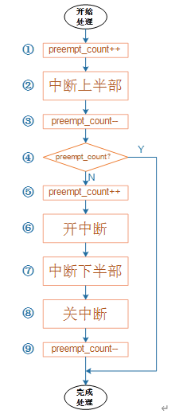

# 调试

## debug

### 硬中断

1. 当 `gpio` 作为外部中断使用时，调用 `cat /proc/interrupts` 命令可以查看**所有硬中断的相关信息** :
   - `CPU0` : 表示在哪个 `CPU`  核心上处理。
   - 16 : 软件中断号（`IRQ Number`）。**软件中断号是唯一的**，内核通过这个标识找到对应的中断处理程序。
   - 106214 : 中断号对应的中断在 `CPU0` 上被触发的总次数。例如，中断号 16 被触发了 106,214 次。
   - `GPC` : 表示中断控制器的类型。在这里，`GPC` 是一个中断控制器的名字，可能与特定硬件平台相关。它负责将硬件中断请求映射到内核。
   - 55 : 表示硬件中断信号（`HW interrupt ID`），这是特定平台中断控制器的内部编号。
   - `Level` : 触发类型。`Level` 表示电平触发，`Edge` 表示边沿触发。
   - `i.MX Timer Tick` : 表示中断对应的功能或设备。常见的设备名称包括定时器、串口、SPI 控制器等。在这里，`i.MX Timer Tick` 是一个定时器中断，用于系统时钟调度。

```shell
$ cat /proc/interrupts 
           CPU0       
 16:     106214       GPC  55 Level     i.MX Timer Tick
 18:          0       GPC  31 Level     2008000.ecspi
 19:          0       GPC  33 Level     2010000.ecspi
 20:        315       GPC  26 Level     2020000.serial
```

### 软中断

1. `cat /proc/soft` 可以查看各种**软中断**在不同的 `CPU` 上累计的运行次数。

```shell
$ cat /proc/softirqs 
                    CPU0       
          HI:          3
       TIMER:       1424
      NET_TX:         10
      NET_RX:        137
       BLOCK:          0
    IRQ_POLL:          0
     TASKLET:       1446
       SCHED:          0
     HRTIMER:          0
         RCU:       2568
```

## 性能优化

### 亲缘绑定

1. `/proc/irq/` 目录中存放着**以软件中断号命名的文件夹**，每个中断号文件夹下都有几个节点，这些节点存放对应中断号的信息。我们一般看 **`smp_affinity` 节点，该节点代表中断号与 `CPU` 之间的亲缘绑定关系**。如果某个中断号绑定了一个 `CPU` 核，那么这个中断就会一直在这个 `CPU` 上处理。利用该节点，我们可以让性能进行优化，使得空闲 `CPU` 忙起来。

```shell
$ cat /proc/irq/44/smp_affinity
1
```

2. 我们可以通过串口对该参数进行赋值，不过重启之后就会消失。
3. 我们也可以**通过 `irq_set_affinity()` 函数指定中断掩码，最终实现将某个中断被固定到指定的 `CPU` 运行**。

### 均衡负载

1. 当我们调用 `cat /proc/soft` 查询软中断在不同的 `CPU` 执行情况时，在不同的 `CPU` 上累计应当差不多。

## 中断唤醒系统

1. `Linux` 内核 


# 面试题

## 上下文的概念是什么

1. 上下文是**指程序或者系统当前所处的执行环境和状态**，它包括了**程序的状态、寄存器值、内存映射、文件描述符、信号处理器等信息**。上下文是一个抽象的概念，它描述了程序或者系统的执行环境和运行状态。
2. **上文（Context of the Process/Thread Before）** : **用于保存当前任务运行状态**，操作系统需要保存的全部寄存器值、程序计数器（PC）、堆栈指针等。
3. **下文（Context of the Process/Thread After）** : **恢复任务时的状态信息，通常是从保存的“上文”中恢复的内容**。

## Linux 中存在几种上下文

2. 在 `Linux` 中通常分为**中断上下文**和**进程上下文**。
3. **中断上下文**又分为**硬中断上下文**和**软中断上下文**。
4. 一个进程的上下文可以分为三个部分 : **用户级上下文**、**寄存器上下文**以及**系统级上下文**。

   - **用户级上下文** : 正文、数据、用户堆栈以及共享存储区；
   - **寄存器上下文** : 通用寄存器、程序寄存器(`IP`)、处理器状态寄存器(`EFLAGS`)、栈指针(`ESP`)；
   - **系统级上下文** : 进程控制块 `task_struct`、内存管理信息(`mm_struct`、`vm_area_struct`、`pgd`、`pte`)、内核栈。

## 中断上下文和进程上下文的区别

1. 

## 中断上半部、下半部关系

1. **同一个中断上半部和下半部是多对一的关系**。

2. 因为中断下半部是可以被中断的，当中断**刚执行到步骤7**时，**同样的中断**又发生了一次，那么就会跳转到步骤1。然后执行到步骤4，发现 `preempt_count` 不是0，那么**第二次中断的中断下半部不会被执行，而是返回恢复中断线程，也就是第一次中断的终端下半部**。



## 为什么中断上下文不允许休眠

2. **所谓睡眠就是调用 `schedule` 函数让出 `CPU`** ，使其执行其他任务，**这个过程涉及到进程栈空间的切换**。
3. 如果是进程A发生中断，而在中断上下文中又调用 `schedule` 函数进行了调度，变成进程B。那么此时**进程A的上下文信息将会被进程B的内容覆盖，从而导致无法回到进程A**。
4. 因为中断上半部是处于关中断状态。当我们调用睡眠函数时，**睡眠函数会调用 `schedule` 函数让出 `CPU`**，进而去执行其他进程。**而中断一直处于关闭状态，无法 Linux 内核无法进行正常的调度行为，从而系统崩溃**。

## 为什么进程上下文可以休眠

1. 

## 中断上下文有那些注意事项

1. **不能调用可能引起阻塞等待的 `API`** 。
2. **不能尝试获取信号量**。因为信号量会引起睡眠。
3. **不能执行耗时的任务**。因为中断上下文是禁用中断，如果长时间处于中断上下文，会导致内核大量的服务和请求无法被响应，严重影响系统功能。
4. **不能访问虚拟内存**。因为中断在内核空间。

## 用户态到内核态的几种方式

1. **系统调用** : 当我们执行 `open()` 、`read()`、 `write()`**操作文件**，调用 `fork()` **创建进程**，`malloc()` **分配内存**都将会进行用户态到内核态的转变。
2. **中断** : 触发中断，操作系统会暂时中断当前执行的用户态程序，转而处理该中断请求。
3. **异常** : 异常触发时，处理器会将程序的执行转移到操作系统内核态，操作系统会进行处理，比如抛出信号、终止进程等。

## 为什么中断号会稀疏，不连续情况

1. 如果只有**一个 `CPU` ，一个中断控制器**，我们可以保证物理中断信号到虚拟中断号的映射是线性的，这样可以使用**数组**进行表示并没有问题。
2. 但如果是**多个 `CPU` ，多个中断控制器**，就没有办法保证虚拟中断信号是连续的，因此需要使用到**基数树**。
   - 在多 CPU 和多中断控制器的情况下，不同中断控制器管理的中断号可能存在以下问题：
     - **非连续映射**：每个中断控制器的中断号范围可能不同，并且在多个控制器之间可能存在“稀疏”分布。例如：控制器 A 管理中断号 `0-31`。控制器 B 管理中断号 `100-131`。之间存在较大间隙
     - **动态分配**：稀疏分布导致**无法预先知道要获取的内存**。如果使用**数组**可能存在**大量空槽，浪费空间和查找效率**。
   - **基数树**是一种高效的数据结构，特别**适合稀疏键空间**。它通过**路径压缩**和**前缀匹配机制**，解决了中断号稀疏和不连续的问题。
     - **节省存储空间**：基数树只存储有效的中断号路径，不用为空闲的中断号分配存储空间。
     - **支持稀疏键空间**：基数树能够高效地存储和查找稀疏分布的中断号。
     - **灵活性**：基数树支持动态插入和删除中断号映射，非常适合动态分配中断号的场景。

## 硬中断、软中断、信号区别

1. **硬中断** : 外部设备对 `CPU` 的中断。
2. **软中断** : 中断下半部的一种处理机制。
3. **信号** : 内核（其他进程）对某个进程的中断。
4. 软中断和基于软中断的 `tasklet` 如果 **执行超过超过 `2ms` /更高优先级的任务就绪/待处理软中断还有10个**， `Linux` 内核会把后续软中断**放入 `ksoftirqd` 内核线程中执行**。这一设计是为了防止单个软中断占用过多的 CPU 时间，从而影响系统整体性能。
5. 优先级 : 硬中断 > 软中断 > 线程
6. 软中断适度线程化，可以缓解高负载情况下的系统响应。

## 为什么中断上半部不能调用 disable_irq

1. `disable_irq()` 函数可能会造成阻塞。如果该函数是想要禁止当前中断号的中断行为，而又在当前中断中调用该函数，将会造成**死锁**。
2. 因为 `disable_irq()` 函数会等待中断处理程序执行完成再进行禁止，而我们却在中断中调用 `disable_irq()` 函数，最终程序将会卡死。

