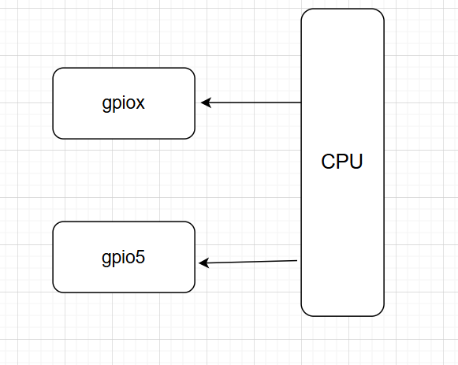
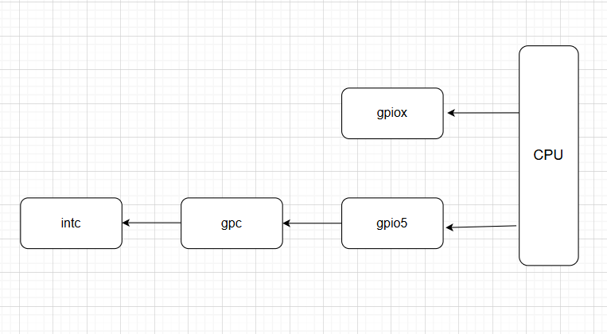

# 设备树

1. 对于板级 `BSP` 工程师，我们只需要了解 `interrupt-parent` 和 `interrupts` 这两个特性。
2. 而对于芯片原厂的 `BSP` 工程师，则需要编写 `interrupts` ，`interrupt-controller` ，`#interrupt-cells` 这三个参数。

## 属性介绍

### interrupt-parent

1. 该参数用于建立**中断信号源**与**中断控制器**之间关联的属性，表明当前中断信号源所属的中断控制器节点，用以确保中断的处理与分发。如下例子中，标识当前的 `key@1` 节点与中断控制器 `gpio5` 相连接。

```dts
key@1 {
    compatible = "dts_key@1";
    interrupt-parent = <&gpio5>;
    //...
};
```



2. 如果 `interrupt-parent` 利用 `&` 包含了其他控制器，那么就会产生**级联**的效果。不过这仅需要了解即可，作为板级 `BSP` 工程师，**这些内容并不是由我们来编写，而是原厂工程师**。

```dts
intc: interrupt-controller@00a01000 {
    #interrupt-cells = <3>;
    //...
};

gpc: gpc@020dc000 {
    interrupt-controller;
    #interrupt-cells = <3>;
    // ...
};

soc {
    interrupt-parent = <&gpc>;
    //...
    aips1: aips-bus@02000000 {
        //...
        gpio5: gpio@020ac000 {
            interrupts = <GIC_SPI 74 IRQ_TYPE_LEVEL_HIGH>,
            <GIC_SPI 75 IRQ_TYPE_LEVEL_HIGH>;
            interrupt-controller;
            #interrupt-cells = <2>;
            //...
        };
    };
};
```



### interrupts

1. `interrupts` 属性中每个中断的中断编号单元数量是由 `#interrupt-cells` 来进行指定的。但是如果你对比过多家三星，NXP，瑞芯微的**板级 `BSP` 设备树**编写会发现**格式都是统一**的。 `#interrupt-cells` 都是2.
2. 这个是不是 `Linux` 内核规定的我就不太清楚了。不过这几家芯片原厂的格式统一都是如下，`IRQ_number` 标识要用哪个中断号，`IRQ_trigger_type` 表示要使用触发中断的方式。

| 类型               | 含义                                                         |
| ------------------ | ------------------------------------------------------------ |
| `IRQ_number`       | 标识要用哪个中断号                                           |
| `IRQ_trigger_type` | 触发方式，拥有类型 : <br />- `IRQ_TYPE_NONE` : **不依赖外部信号触发**。可能是定时器触发，也可是软件触发<br />- `IRQ_TYPE_EDGE_RISING` : 上升沿触发<br />- `IRQ_TYPE_EDGE_FALLING` : 下降沿触发<br />- `IRQ_TYPE_EDGE_BOTH` : 双边沿触发<br />- `IRQ_TYPE_LEVEL_HIGH` : 高电平触发<br />- `IRQ_TYPE_LEVEL_LOW` : 低电平触发 |

```dts
// 格式
interrupts = <IRQ_number IRQ_trigger_type>;

// IRQ_trigger_type 的定义，在 ${kernel}/include/dt-bindings/interrupt-controller/irq.h
#define IRQ_TYPE_NONE           0
#define IRQ_TYPE_EDGE_RISING    1
#define IRQ_TYPE_EDGE_FALLING   2
#define IRQ_TYPE_EDGE_BOTH      (IRQ_TYPE_EDGE_FALLING | IRQ_TYPE_EDGE_RISING)
#define IRQ_TYPE_LEVEL_HIGH     4
#define IRQ_TYPE_LEVEL_LOW      8


// 示例
gpio5: gpio@020ac000 {
            interrupt-controller;
            #interrupt-cells = <2>;
            //...
        };
key@1 {
    compatible = "dts_key@1";
    interrupt-parent = <&gpio5>;
    interrupts = <1 IRQ_TYPE_EDGE_FALLING>;
    //...
};
```

3. 但此时我们又会发现一个问题，为什么 `gpio5` 的 `interrupts` 属性有 3 个呢？这是因为它的父节点包含了 `gpc` ，而在 `gpc` 节点中 `#interrupt-cells = <3>;` 。不过这**些都不是我们板级 `BSP` 工程师要关心的事情了，这些工作应该是原厂工程师来做，我们简单了解即可**。

```dts
gpc: gpc@020dc000 {
    interrupt-controller;
    #interrupt-cells = <3>;
    // ...
};

soc {
    interrupt-parent = <&gpc>;
    //...
    aips1: aips-bus@02000000 {
        //...
        gpio5: gpio@020ac000 {
            interrupts = <GIC_SPI 74 IRQ_TYPE_LEVEL_HIGH>,
            <GIC_SPI 75 IRQ_TYPE_LEVEL_HIGH>;
            interrupt-controller;
            #interrupt-cells = <2>;
            //...
        };
    };
};
```

### #interrupt-cells

1. 通过上述 `interrupts` 属性的分析，我们也应该知道了 `#interrupt-cells` 属性作用。该属性就是用来描述每个中断信号源的中断编号单元的数量。
2. 一般来说，**不同层的 `#interrupt-cells` 为多少，`Linux` 都进行了规定和限制。作为原厂工程师和板级工程师我们只需要填坑即可**。

### interrupt-controller

1. `interrupt-controller` 属性用于**表示当前节点所描述的是一个中断控制器**。**该属性本身没有特定的属性值，只需要出现在属性列表中即可**。
2. 以下面为例子，我们存在 `gpio-controller;` 和 `interrupt-controller;` 两个属性。那么就表明**当前节点是中断控制器，同时也是一个 `GPIO` 控制器**。 

```dts
gpio1: gpio@0209c000 {
    compatible = "fsl,imx6ul-gpio", "fsl,imx35-gpio";
    reg = <0x0209c000 0x4000>;
    interrupts = <GIC_SPI 66 IRQ_TYPE_LEVEL_HIGH>,
    	<GIC_SPI 67 IRQ_TYPE_LEVEL_HIGH>;
    gpio-controller;
    #gpio-cells = <2>;
    interrupt-controller;
    #interrupt-cells = <2>;
};
```

## 获取属性信息 API

### irq_of_parse_and_map

1. 如果我们在设备树中配置 `interrupt-paren` 和 `interrupts`，那么我们就可以调用如下函数找到对应的中断号。
2. 这里需要注意，**一定要符合标准的 `interrupts = <IRQ_number IRQ_trigger_type>;` 属性写法！！！**

| 类型    | 描述                                                         |
| ------- | ------------------------------------------------------------ |
| 作用    | 解析设备树中的 `interrupts` 属性，并将对应的硬件中断号映射为软件中断号 |
| `node`  | 要进行解析的设备节点                                         |
| `index` | 索引号，要从 `interrupts` 属性中第几个中断获取中断号         |
| 返回值  | 成功时，返回一个映射后的软件中断号；失败返回0                |

```c
key@1 {
    compatible = "dts_key@1";
    interrupt-parent = <&gpio5>;
    interrupts = <1 IRQ_TYPE_EDGE_FALLING>;
    //...
};
unsigned int irq_of_parse_and_map(struct device_node *node, int index);
```

### irq_get_irq_data

1. 如果我们希望获取中断号的触发类型，就需要先调用该函数。

| 类型   | 描述                                                         |
| ------ | ------------------------------------------------------------ |
| 作用   | 获取与指定中断号（`IRQ`）相关的中断数据                      |
| `node` | 需要获取数据的中断号（`IRQ`），该值表示一个特定的中断资源    |
| 返回值 | 成功时，返回一个指向 `irq_data` 结构体的指针，表示该中断号的中断数据；失败返回 NULL |

```c
struct irq_data *irq_get_irq_data(unsigned int irq);
```

### irqd_get_trigger_type

1. 当我们获取了中断号（`IRQ`）相关的中断数据后，就可以调用该函数获取设备树中指定的中断类型了。

| 类型   | 描述                                                         |
| ------ | ------------------------------------------------------------ |
| 作用   | 获取获取指定中断的中断触发类型                               |
| `d`    | 要获取的中断触发类型的中断，传入一个指向 `irq_data` 结构体的指针 |
| 返回值 | 返回中断触发类型                                             |

```c
u32 irqd_get_trigger_type(struct irq_data *d);
```

2. 需要注意，**设备树中 `interrupts` 参数应当与 `request_irq` 中设置的中断触发类型一致，否则会可能出现如下报错 ！**因此我们需要使用当前的 `API` 获取设备树中设置的真实中断触发类型。

```shell
irq: type mismatch, failed to map hwirq-1 for /soc/aips-bus@02000000/gpio@020ac000!
```

### of_irq_get

1.  `of_irq_get()` 函数是对 `irq_of_parse_and_map` 的改进版，更适用于复杂或需要考虑延迟加载的场景。如果**你的应用场景涉及中断控制器可能存在延迟初始化问题，建议使用 `of_irq_get`**。 

```c
int of_irq_get(struct device_node *dev, int index)
{
	int rc;
	struct of_phandle_args oirq;
	struct irq_domain *domain;

	rc = of_irq_parse_one(dev, index, &oirq);
	if (rc)
		return rc;

	domain = irq_find_host(oirq.np);
	if (!domain)
		return -EPROBE_DEFER;

	return irq_create_of_mapping(&oirq);
}

unsigned int irq_of_parse_and_map(struct device_node *dev, int index)
{
	struct of_phandle_args oirq;

	if (of_irq_parse_one(dev, index, &oirq))
		return 0;

	return irq_create_of_mapping(&oirq);
}
```

