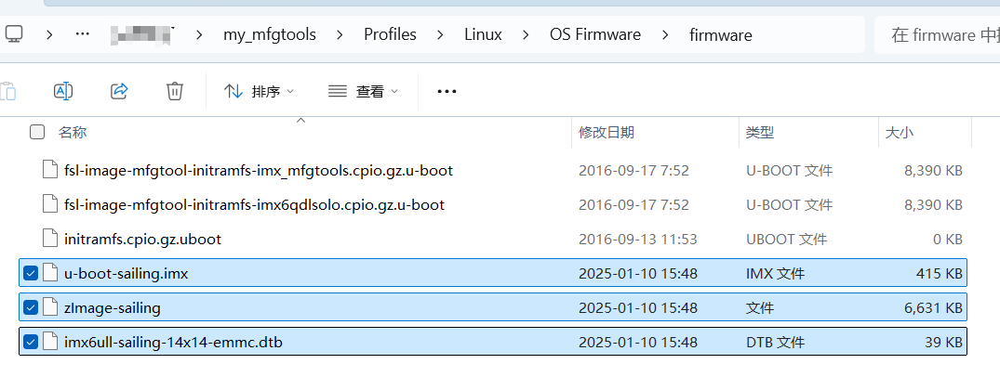
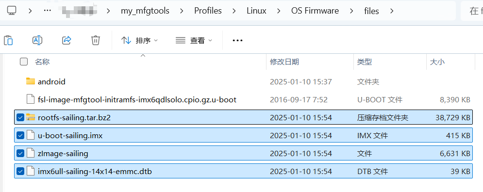

# 确认系统文件名字

1. 进入 mfgtool 工具目录，除了 `mfgtool2-yocto-mx-evk-emmc.vbs` 以外的其他 `*.vbs` 文件全部删除。
2. 进入 `Profiles\Linux\OS Firmware\firmware` 目录，只保留如下三个文件，其他文件全部删除。

```
fsl-image-mfgtool-initramfs-imx_mfgtools.cpio.gz.u-boot
fsl-image-mfgtool-initramfs-imx6qdlsolo.cpio.gz.u-boot
initramfs.cpio.gz.uboot
```

3. 将 设备树，zImage，uboot拷贝到如上目录。



4. 进入 `Profiles\Linux\OS Firmware\files` 目录，只保留如下两个文件，其他文件全部删除。

```
android
fsl-image-mfgtool-initramfs-imx6qdlsolo.cpio.gz.u-boot
```

5. 将 设备树，zImage，uboot，根文件系统 拷贝到如上目录。



# 定制 .vbs 文件

1. 进入 `mfgtool` 工具目录，将 `mfgtool2-yocto-mx-evk-emmc.vbs` 拷贝一份为 `mfgtool2-sailing-14x14-emmc.vbs` 。